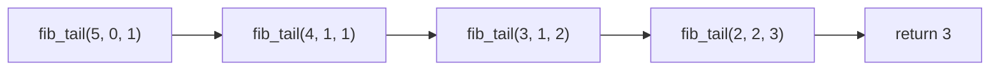

# Hello Algorithm notes


全书内容

- 复杂度分析
- 数据结构
- 算法

## 初识算法

- 算法是在有限时间内解决特定问题的一组指令或操作步骤
  - 问题包含清晰的输入和输出定义
  - 能够在有限步骤、时间和内存空间下完成
  - 在相同的输入和运行条件下，输出始终相同
- 数据结构是组织和存储数据的方式，涵盖数据内容、数据之间关系和数据操作方法。目标包括
  - 空间占用要少，以节省内存
  - 数据操作要快，包括数据访问、添加、删除、更新等
  - 数据表示简洁，逻辑信息简洁，好让算法高效
- 注意数据结构与算法高度相关，比如采取图的结构和链表的结构，都可以从输入得到所需输出，但是算法设计就不同，且在访问速度和内存占用上有别


## 复杂度分析

算法效率的衡量维度

- 时间效率：算法运行时间的长短
- 空间效率：算法占用内存空间的大小

评估方法

- 实际测试(局限性大)
  - 测试环境会有干扰，比如是否适合并行
  - 消耗资源，因为输入数据量大大小会影响算法效率的结论，故需要测试各种规模的输入数据
- 理论估算：(渐近)复杂度分析
  - 可以计算算法在理论上的时间复杂度和空间复杂度
  - 高效

分析算法复杂度涉及循环执行某段代码，下面介绍迭代和递归，两种重复的方法。

- 迭代：从第一步，第二步，一步一步往上走，直到\\(n\\)
- 递归，为了到达\\(n\\)，那么要先到达\\(n-1\\)，一直如此直到拆解到第一步

### 迭代

迭代(iteration)是一种重复执行某个任务的控制结构。程序会在满足一定的条件下循环执行某段代码，直到这个条件不再满足。

- for循环，在预先知道迭代次数上限时使用
- while循环，程序每轮都会先检查条件，如果条件为真，则继续执行，否则就结束循环。循环内部会更新条件变量
- 循环套循环

示例：\\(1+2+3+\cdots+n\\)，\\(\sum_{i=1}^n\sum_{j=1}^n f(i,j)\\)

```python
def for_loop(n: int) -> int:
    """for 循环"""
    res = 0 # result初始化结果变量
    for i in range(1, n + 1):
        res += i
    return res

def while_loop(n: int) -> int:
    """while 循环"""
    res = 0
    i = 1  # 初始化条件变量
    while i <= n:
        res += i
        i += 1  # 更新条件变量
    return res

def nested_for_loop(n: int) -> str:
    """双层 for 循环"""
    res = 0
    # 循环 i = 1, 2, ..., n-1, n
    for i in range(1, n + 1):
        # 循环 j = 1, 2, ..., n-1, n
        for j in range(1, n + 1):
            res += f({i}, {j})
    return res
```

### 递归

递归(recursion)是一种算法策略，通过函数调用自身来解决问题。

- 递：程序不断深入地调用自身，通常传入更小或更简化的参数，直到达到“终止条件”
- 归：触发“终止条件”后，程序从最深层的递归函数开始逐层返回，汇聚每一层的结果

普通递归示例：\\(1+2+3+\cdots+n\\)

```python
def recur(n: int) -> int:
    """递归"""
    # 终止条件
    if n == 1:
        return 1
    # 递：递归调用
    res = recur(n - 1)
    # 归：返回结果
    return n + res
```


递归的特点就是每次调用自身，但是会在内存中记录当前的调用，称为“栈帧空间”。比如`recur(5)`就会凭空产生`recur(5)`，`recur(4)`，`recur(3)`，`recur(2)`，`recur(1)`，所以更耗费内存。且由于涉及函数调用，所以比循环更废时间。为此定义**递归深度**：*在触发终止条件前，同时存在的未返回的递归函数个数*。过深的递归可能导致栈溢出错误。

这段代码的存栈过程和空间释放过程可以用下面这段代码理解。

```python
def for_loop_recur(n: int) -> int:
    """使用数组模拟递归"""
    # 使用一个显式的栈来模拟系统调用栈
    stack = []
    res = 0
    # 递：递归调用
    for i in range(n, 0, -1):
        # 通过“入栈操作”模拟“递”
        stack.append(i)
    # 此时stack = [n, n-1, ... 1]
    # 归：返回结果
    while stack:
        # 通过“出栈操作”模拟“归”
        res += stack.pop()
    # res = 1+2+3+...+n
    return res
```

#### 尾递归

如果函数在返回前的最后一步才进行递归调用，则该函数可以被编译器或解释器优化，使其在空间效率上与迭代相当。通过示例分析一下

```python
def tail_recur(n, res=0):
    """尾递归"""
    # 终止条件
    if n == 0:
        return res
    # 尾递归调用
    res += n
    return tail_recur(n - 1, res)
```

之前的代码的return可以简写为`return n+recur(n - 1)`，所以递归调用recur(n - 1)返回后，还要再做一次加法运算`+n`。尾递归的代码是先计算`+n`，再return。模拟如下

```python
def tail_recur_stack(n: int) -> int:
    """使用显式栈模拟尾递归"""
    stack = [(n, 0)]  # 保存 (n, res)，初始 res=0
    res = 0
    while stack:
        n, res = stack.pop()
        if n == 0:
            return res
        # 尾递归：只需更新参数后再压栈
        stack.append((n - 1, res + n))
```


尾递归中，函数返回到上一层级后，无须继续执行其他操作，因此系统无须保存上一层函数的上下文。但是Python不支持。

#### 递归树

示例：求斐波那契数列\\(f(n) = f(n-1)+f(n-2),f(1)=0,f(2)=1\\)。这种的也可以尾递归优化。

```python
def fib(n: int) -> int:
    """斐波那契数列：递归"""
    # 终止条件 f(1) = 0, f(2) = 1
    if n == 1 or n == 2:
        return n - 1
    # 递归调用 f(n) = f(n-1) + f(n-2)
    res = fib(n - 1) + fib(n - 2)
    # 返回结果 f(n)
    return res

def fib_tail(n: int, a: int = 0, b: int = 1) -> int:
    """
    尾递归版本斐波那契
    a = f(1), b = f(2)
    """
    if n == 1:
        return a
    if n == 2:
        return b
    return fib_tail(n - 1, b, a + b)
```

前者产生深度为n的递归树


后者的调用过程与普通尾递归类似，是一串



### 时间复杂度
