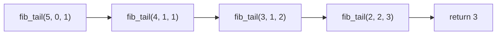
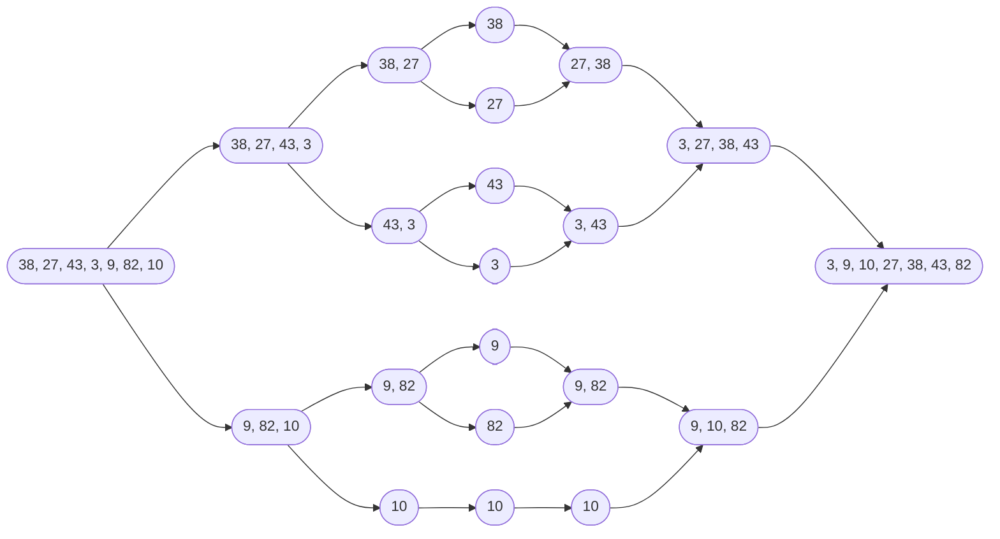

# Hello Algorithm notes

书本链接：[下载](https://github.com/krahets/hello-algo/releases/) \| [在线阅读](https://www.hello-algo.com/chapter_hello_algo/)


全书内容

- 复杂度分析
- 数据结构
- 算法

## 初识算法

- **算法**是*在有限时间内解决特定问题的一组指令或操作步骤*
  - 问题包含清晰的输入和输出定义
  - 能够在有限步骤、时间和内存空间下完成
  - 在相同的输入和运行条件下，输出始终相同
- **数据结构**是*组织和存储数据的方式*，涵盖数据内容、数据之间关系和数据操作方法。目标包括
  - 空间占用要少，以节省内存
  - 数据操作要快，包括数据访问、添加、删除、更新等
  - 数据表示简洁，逻辑信息简洁，好让算法高效
- 注意数据结构与算法高度相关，比如采取图的结构和链表的结构，都可以从输入得到所需输出，但是算法设计就不同，且在访问速度和内存占用上有别


## 复杂度分析 Complexiy Analysis

算法效率的衡量维度

- **时间效率**：*算法运行时间的长短*
- **空间效率**：*算法占用内存空间的大小*

评估方法<a id="复杂度分析-实测"> </a>

- 实际测试(局限性大)
  - 测试环境会有干扰，比如是否适合并行
  - 消耗资源，因为输入数据量大大小会影响算法效率的结论，故需要测试各种规模的输入数据
- 理论估算：(渐近)复杂度分析
  - 可以计算算法在理论上的时间复杂度和空间复杂度
  - 高效

分析算法复杂度涉及循环执行某段代码，下面介绍迭代和递归，两种重复的方法。

- 迭代：从第一步，第二步，一步一步往上走，直到\\(n\\)
- 递归，为了到达\\(n\\)，那么要先到达\\(n-1\\)，一直如此直到拆解到第一步

### 迭代 Iteration

**迭代**是*一种重复执行某个任务的控制结构*。程序会在满足一定的条件下循环执行某段代码，直到这个条件不再满足。

- for循环，在预先知道迭代次数上限时使用
- while循环，程序每轮都会先检查条件，如果条件为真，则继续执行，否则就结束循环。循环内部会更新条件变量
- 循环套循环

示例：\\(1+2+3+\cdots+n\\)，\\(\sum_{i=1}^n\sum_{j=1}^n f(i,j)\\)

<details markdown="1" data-auto-footer>
<summary>循环计算示例</summary>

```python
def for_loop(n: int) -> int:
    """for 循环"""
    res = 0 # result初始化结果变量
    for i in range(1, n + 1):
        res += i
    return res

def while_loop(n: int) -> int:
    """while 循环"""
    res = 0
    i = 1  # 初始化条件变量
    while i <= n:
        res += i
        i += 1  # 更新条件变量
    return res

def nested_for_loop(n: int) -> str:
    """双层 for 循环"""
    res = 0
    # 循环 i = 1, 2, ..., n-1, n
    for i in range(1, n + 1):
        # 循环 j = 1, 2, ..., n-1, n
        for j in range(1, n + 1):
            res += f({i}, {j})
    return res
```
</details>

### 递归 Recursion

**递归**是*一种算法策略，通过函数调用自身来解决问题。*

- 递：程序不断深入地调用自身，通常传入更小或更简化的参数，直到达到"终止条件"
- 归：触发"终止条件"后，程序从最深层的递归函数开始逐层返回，汇聚每一层的结果

普通递归示例：\\(1+2+3+\cdots+n\\)

<details markdown="1" data-auto-footer>
<summary>递归示例</summary>

```python
def recur(n: int) -> int:
    """递归"""
    # 终止条件
    if n == 1:
        return 1
    # 递：递归调用
    res = recur(n - 1)
    # 归：返回结果
    return n + res
```
</details>


递归的特点就是每次调用自身，但是会在内存中记录当前的调用，称为"栈帧空间"。比如`recur(5)`就会凭空产生`recur(5)`，`recur(4)`，`recur(3)`，`recur(2)`，`recur(1)`，所以更耗费内存。且由于涉及函数调用，所以比循环更废时间。为此定义**递归深度**：*在触发终止条件前，同时存在的未返回的递归函数个数*。过深的递归可能导致栈溢出错误。

这段代码的存栈过程和空间释放过程可以用下面这段代码理解。

<details markdown="1" data-auto-footer>
<summary>数组模拟递归</summary>

```python
def for_loop_recur(n: int) -> int:
    """使用数组模拟递归"""
    # 使用一个显式的栈来模拟系统调用栈
    stack = []
    res = 0
    # 递：递归调用
    for i in range(n, 0, -1):
        # 通过"入栈操作"模拟"递"
        stack.append(i)
    # 此时stack = [n, n-1, ... 1]
    # 归：返回结果
    while stack:
        # 通过"出栈操作"模拟"归"
        res += stack.pop()
    # res = 1+2+3+...+n
    return res
```
</details>


#### 尾递归 Tail Recursion

定义**尾递归**：*如果函数在返回前的最后一步才进行递归调用*，则该函数可以被编译器或解释器优化，使其在空间效率上与迭代相当。通过示例分析一下

<details markdown="1" data-auto-footer>
<summary>尾递归示例</summary>

```python
def tail_recur(n, res=0):
    """尾递归"""
    # 终止条件
    if n == 0:
        return res
    # 尾递归调用
    res += n
    return tail_recur(n - 1, res)
```
</details>


之前的代码的return可以简写为`return n+recur(n - 1)`，所以递归调用recur(n - 1)返回后，还要再做一次加法运算`+n`。尾递归的代码是先计算`+n`，再return。模拟如下

<details markdown="1" data-auto-footer>
<summary>显式栈模拟尾递归</summary>

```python
def tail_recur_stack(n: int) -> int:
    """使用显式栈模拟尾递归"""
    stack = [(n, 0)]  # 保存 (n, res)，初始 res=0
    res = 0
    while stack:
        n, res = stack.pop()
        if n == 0:
            return res
        # 尾递归：只需更新参数后再压栈
        stack.append((n - 1, res + n))
```
</details>


尾递归中，函数返回到上一层级后，无须继续执行其他操作，因此系统无须保存上一层函数的上下文。但是Python不支持。

#### 递归树 Recursion Tree

示例：求斐波那契数列\\(f(n) = f(n-1)+f(n-2),f(1)=0,f(2)=1\\)。这种的也可以尾递归优化。

<details markdown="1" data-auto-footer>
<summary>递归，尾递归求斐波那契数列</summary>

```python
def fib(n: int) -> int:
    """斐波那契数列：递归"""
    # 终止条件 f(1) = 0, f(2) = 1
    if n == 1 or n == 2:
        return n - 1
    # 递归调用 f(n) = f(n-1) + f(n-2)
    res = fib(n - 1) + fib(n - 2)
    # 返回结果 f(n)
    return res

def fib_tail(n: int, a: int = 0, b: int = 1) -> int:
    """
    尾递归版本斐波那契
    a = f(1), b = f(2)
    """
    if n == 1:
        return a
    if n == 2:
        return b
    return fib_tail(n - 1, b, a + b)
```
</details>

前者产生深度为n的递归树


后者的调用过程与普通尾递归类似，是一串



### 时间复杂度 Time Complexity

直接运行计算时间，如[前所述](#复杂度分析-实测)不现实。**时间复杂度**分析统计的不是算法运行时间，定义为：*算法运行时间随着数据量变大时的增长趋势*。定义**函数渐近上界**：*给定一个输入大小为\\(n\\)的函数，算法的操作数量是一个关于输入数据大小\\(n\\)的函数，记为\\(T(n)\\)。若存在正实数\\(c\\)和实数\\(n_0\\)，使得对于所有的\\(n > n_0\\)，均有\\(T(n) \leq c \cdot f(n)\\)，则可认为\\(f(n)\\)给出了\\(T(n)\\)的一个渐近上界，记为\\(T(n) = O(f(n))\\)。*


1. 常数阶\\(O(1)\\)：\\(T(n)=1,T(n)=100000\\)，循环次数，运算次数都和输入数据大小无关
2. 对数阶\\(O(\log(n))\\)：\\(T(n)=\log_2(n)\\)，常见于运算次数在每个循环中减半的情况，比如一些递归函数
3. 线性阶\\(O(n)\\)：\\(T(n)=n,T(n)=3n+2\\)，常见于单层循环，总运算次数相对于输入数据大小以线性级别增长
4. 线性对数阶\\(O(n\log(n))\\)：\\(T(n)=1,T(n)=100000\\)，常见于嵌套循环。一个\\(O(n)\\)套一个\\(O(\log(n))\\)
5. 平方阶\\(O(n^2)\\)：\\(T(n)=1,T(n)=100000\\)，常见于嵌套循环。一个\\(O(n)\\)套一个\\(O(n)\\)
6. 指数阶\\(O(2^n)\\)：\\(T(n)=1,T(n)=100000\\)，常见于运算次数在每个循环加倍的情况，比如计算递归树
7. 阶乘阶\\(O(n!)\\)：\\(T(n)=1,T(n)=100000\\)，常见于运算次数在每个循环翻倍，倍数为上一个循环的运算次数减去一个常数


<details markdown="1" data-auto-footer>
<summary>示例代码</summary>

```python
def constant(n: int) -> int:
    """常数阶"""
    count = 0
    size = 100000
    for _ in range(size):
        count += 1
    return count
def logarithmic(n: int) -> int:
    """对数阶(循环实现)"""
    count = 0
    while n > 1:
        n = n / 2
        count += 1
    return count
def log_recur(n: int) -> int:
    """对数阶(递归实现)"""
    if n <= 1:
        return 0
    return log_recur(n / 2) + 1
def linear(n: int) -> int:
    """线性阶"""
    count = 0
    for _ in range(n):
        count += 1
    return count
def array_traversal(nums: list[int]) -> int:
    """线性阶(遍历数组)"""
    count = 0
    # 循环次数与数组长度成正比
    for num in nums:
        count += 1
    return count

def linear_log_recur(n: int) -> int:
    """线性对数阶"""
    if n <= 1:
        return 1
    # 一分为二，子问题的规模减小一半
    count = linear_log_recur(n // 2) + linear_log_recur(n // 2)
    # 当前子问题包含 n 个操作
    for _ in range(n):
        count += 1
    return count
def quadratic(n: int) -> int:
    """平方阶"""
    count = 0
    # 循环次数与数据大小 n 成平方关系
    for i in range(n):
        for j in range(n):
            count += 1
    return count
def bubble_sort(nums: list[int]) -> int:
    """平方阶(冒泡排序)"""
    count = 0  # 计数器
    # 外循环：未排序区间为 [0, i]
    for i in range(len(nums) - 1, 0, -1):
        # 内循环：将未排序区间 [0, i] 中的最大元素交换至该区间的最右端
        for j in range(i):
            if nums[j] > nums[j + 1]:
                # 交换 nums[j] 与 nums[j + 1]
                tmp: int = nums[j]
                nums[j] = nums[j + 1]
                nums[j + 1] = tmp
                count += 3  # 元素交换包含 3 个单元操作
    return count

def exponential(n: int) -> int:
    """指数阶(循环实现)"""
    count = 0
    base = 1
    # 细胞每轮一分为二，形成数列 1, 2, 4, 8, ..., 2^(n-1)
    for _ in range(n):
        for _ in range(base):
            count += 1
        base *= 2
    # count = 1 + 2 + 4 + 8 + .. + 2^(n-1) = 2^n - 1
    return count
def exp_recur(n: int) -> int:
    """指数阶(递归实现)"""
    if n == 1:
        return 1
    return exp_recur(n - 1) + exp_recur(n - 1) + 1
def factorial_recur(n: int) -> int:
    """阶乘阶(递归实现)"""
    if n == 0:
        return 1
    count = 0
    # 从 1 个分裂出 n 个
    for _ in range(n):
        count += factorial_recur(n - 1)
    return count
```
</details>


算法的时间效率往往不是固定的，而是与输入数据的分布有关。为此定义算法的**最差时间复杂度**为\\(O(n)\\)，**最佳时间复杂度**为\\(\Omega(n)\\)。最简单的例子，在数组中寻找元素\\(1\\)出现的第一个索引。数组如果第一个元素就是\\(1\\)，就达到了最佳时间复杂度；若仅有一个元素\\(1\\)且排在最后，那就达到最差时间复杂度。在随机输入数据下的运行效率则定义为**平均时间复杂度**，使用记号\\(\Theta(n)\\)。

### 空间复杂度 Space Complexity

**空间复杂度**用于*衡量算法占用内存空间随着数据量变大时的增长趋势*。

- 输入空间：用于存储算法的输入数据
- 暂存空间：用于存储算法在运行过程中的变量、对象、函数上下文等数据
  - 暂存数据：用于保存算法运行过程中的各种常量、变量、对象等
  - 栈帧空间：用于保存调用函数的上下文数据。系统在每次调用函数时都会在栈顶部创建一个栈帧，函数返回后，栈帧空间会被释放
  - 指令空间：用于保存编译后的程序指令，在实际统计中通常忽略不计
- 输出空间：用于存储算法的输出数据

计算时，一般统计暂存数据、栈帧空间和输出数据三部分。因为内存空间是一项硬性要求，通常只关注最差空间复杂度：

- 输入数据情况最差，比如说真要是循环起来，一定要到最后一个元素
- 以算法运行中的峰值内存为准

<details markdown="1" data-auto-footer>
<summary>示例代码</summary>

```python
def function() -> int:
    # 执行某些操作
    return 0

def loop(n: int):
    """循环的空间复杂度为 O(1)"""
    for _ in range(n):
        function()

def recur(n: int):
    """递归的空间复杂度为 O(n)"""
    if n == 1:
        return
    return recur(n - 1)
```
</details>

|函数|时间复杂度|空间复杂度|
|:-|:-|:-|
|loop|\\(O(n)\\)|\\(O(1)\\)，每次循环不占用栈帧空间|
|recur|\\(O(n)\\)|\\(O(n)\\)，每次循环栈帧空间+1|

常见类型如下

1. 常数阶\\(O(1)\\)：各个对象变量都和输入数据大小无关，对于支持尾递归优化的变成语言，其空间复杂度也是\\(O(1)\\)。不过绝大多数编程语言(例如 Java、Python、C++、Go、C# 等)不支持自动优化尾递归。
2. 对数阶\\(O(\log(n))\\)：常见于分治算法，例如归并排序，
3. 线性阶\\(O(n)\\)：常见于元素数量与\\(n\\)成正比的数组、链表、栈、队列等
4. 平方阶\\(O(n^2)\\)：常见于矩阵和图，元素数量与\\(n\\)成平方关系
5. 指数阶\\(O(2^n)\\)：常见于常见于二叉树

<details markdown="1" data-auto-footer>
<summary>示例代码</summary>

```python
def linear(n: int):
    """线性阶"""
    # 长度为 n 的列表占用 O(n) 空间
    nums = [0] * n
    # 长度为 n 的哈希表占用 O(n) 空间
    hmap = dict[int, str]()
    for i in range(n):
        hmap[i] = str(i)
def linear_recur(n: int):
    """线性阶(递归实现)"""
    print("递归 n =", n)
    if n == 1:
        return
    linear_recur(n - 1)
def quadratic(n: int):
    """平方阶"""
    # 二维列表占用 O(n^2) 空间
    num_matrix = [[0] * n for _ in range(n)]
def quadratic_recur(n: int) -> int:
    """平方阶(递归实现)"""
    if n <= 0:
        return 0
    # 数组 nums 长度为 n, n-1, ..., 2, 1
    nums = [0] * n
    return quadratic_recur(n - 1)

def build_tree(n: int) -> TreeNode | None:
    """指数阶(建立满二叉树)"""
    if n == 0:
        return None
    root = TreeNode(0)
    root.left = build_tree(n - 1)
    root.right = build_tree(n - 1)
    return root
def merge_sort(nums: list[int]) -> list[int]:
    """普通实现：归并排序(迭代版，自底向上)"""
    n = len(nums)
    size = 1
    while size < n:
        for left in range(0, n - size, size * 2):
            mid = left + size
            right = min(left + size * 2, n)
            nums[left:right] = merge(nums[left:mid], nums[mid:right])
        size *= 2
    return nums
def merge_sort_recur(nums: list[int]) -> list[int]:
    """递归实现：归并排序(自顶向下)"""
    if len(nums) <= 1:
        return nums
    mid = len(nums) // 2
    left = merge_sort_recur(nums[:mid])
    right = merge_sort_recur(nums[mid:])
    return merge(left, right)

def merge(left: list[int], right: list[int]) -> list[int]:
    res = []
    i = j = 0
    while i < len(left) and j < len(right):
        if left[i] <= right[j]:
            res.append(left[i]); i += 1
        else:
            res.append(right[j]); j += 1
    res.extend(left[i:])
    res.extend(right[j:])
    return res
```
</details>


归并排序的递归树图



优化时，降低时间复杂度通常需要以提升空间复杂度为代价，反之亦然，鱼与熊掌不可兼得。在大多数情况下，时间比空间更宝贵，因此"以空间换时间"通常是更常用的策略。若是在数据量很大的情况下，控制空间复杂度也非常重要。

## 数据结构 Data Structure

### 数据结构分类

依据逻辑结构分类

- 线性数据结构：数组、链表、栈、队列、哈希表，元素之间是一对一的顺序关系
- 非线性数据结构
  - 树形结构：树、堆、哈希表，元素之间是一对多的关系
  - 网状结构：图，元素之间是多对多的关系


依据物理结构分类

- 连续空间存储(数组)，可实现：栈、队列、哈希表、树、堆、图、矩阵、张量(维度\\(\geq 3\\)的数组)等。数组在初始化后长度不可变，是静态数据结构，除非重新分配内存。
- 分散空间存储(链表)，可实现：栈、队列、哈希表、树、堆、图等。链表在初始化后，仍可以在程序运行过程中对其长度进行调整，是动态数据结构。

当算法程序运行时，正在处理的数据主要存储在内存中。系统通过内存地址来访问目标位置的数据。


某块内存若被程序一占用，通常无法被其他程序同时使用了。因此算法在涉及时要考虑内存资源

- 占用的内存峰值
- 若缺少连续大块的内存空间，考虑链表

### 基本数据类型

- 整数类型 `byte`、`short`、`int`、`long`
- 浮点数类型 `float`、`double` ，用于表示小数
- 字符类型 `char` ，用于表示各种语言的字母、标点符号甚至表情符号等
- 布尔类型 `bool` ，用于表示“是”与“否”判断

存储方式为二进制，一个二进制位占1比特。大多情况，1字节由8比特组成。在Java中

| 类型   | 符号     | 占用空间 | 最小值                   | 最大值                  | 默认值         |
| -- | ---- | ---- | ---- | --- | -- |
| 整数   | `byte`   | 1 字节   | \\(-2^7\\) (\\(-128\\))      | \\(2^7 - 1\\) (\\(127\\))     |\\(0\\)            |
|        | `short`  | 2 字节   | \\(-2^{15}\\)               | \\(2^{15} - 1\\)            | \\(0\\)            |
|        | `int`    | 4 字节   | \\(-2^{31}\\)               | \\(2^{31} - 1\\)            | \\(0\\)            |
|        | `long`   | 8 字节   | \\(-2^{63}\\)               | \\(2^{63} - 1\\)            | \\(0\\)            |
| 浮点数 | `float`  | 4 字节   | \\(1.175 \times 10^{-38}\\)  | \\(3.403 \times 10^{38}\\)  | \\(0.0\text{f}\\)  |
|        | `double` | 8 字节   | \\(2.225 \times 10^{-308}\\)| \\(1.798 \times 10^{308}\\) | \\(0.0\\)          |
| 字符   | `char`   | 2 字节   | \\(0\\)                      | \\(2^{16} - 1\\)            | \\(0\\)            |
| 布尔   | `bool`   | 1 字节   | \\(\text{false}\\)           |\\(\text{true}\\)           | \\(\text{false}\\) |

- 现代计算机 CPU 通常将 1 字节作为最小寻址内存单元。所以布尔量，尽管只要1比特，也存储为1字节
- 不同编程语言的存储数据方式不尽相同

### 数字编码

因为计算机内硬件电路主要是基于加法运算设计的，所以需要特殊的编码方式，来适应这种计算方式，可以简化硬件设计，提高运算效率。为此定义

- **原码(sign-magnitude)**：数字的二进制表示的最高位视为符号位，其中\\(0\\)表示正数，\\(1\\)表示负数，其余位表示数字的值
- **反码(1's complement)**：正数的反码与其原码相同，负数的反码是对其原码除符号位外的所有位取反
- **补码(2's complement)**：正数的补码与其原码相同，负数的补码是在其反码的基础上加\\(1\\)


为什么不用原码？负数的原码不能直接用于运算。示例：计算\\(1+(-2)\\)。其中\\(\rightarrow\\)表示进制转换

$$
\begin{array}{clll}
& 1 &+ &(-2) \newline
\rightarrow&  0000 \; 0001 &+ &1000 \; 0010 \newline
= & 1000 \; 0011 &&\newline
\rightarrow& -3&&
\end{array}
$$

因此引入反码

$$
\begin{array}{clll}
& 1 &+ &(-2) \newline
\rightarrow&  0000 \; 0001 \; \text{(原码)} &+& 1000 \; 0010 \; \text{(原码)} \newline
=&  0000 \; 0001 \; \text{(反码)} &+& 1111  \; 1101 \; \text{(反码)} \newline
=&  1111 \; 1110 \; \text{(反码)}&& \newline
=&  1000 \; 0001 \; \text{(原码)}&& \newline
\rightarrow&  -1&&
\end{array}
$$

另一个问题就是\\(0\\)的表示。原码和反码中\\(0\\)有两种表示：\\(+0\\)和\\(-0\\)。所以在反码之上，再加一得到补码。如此\\(0\\)的表示统一

$$
\begin{array}{cccl}
-0 &\rightarrow& \; & 1000 \; 0000 \; \text{(原码)} \newline
&=& \; & 1111 \; 1111 \; \text{(反码)} \newline
&=& 1\text{(溢出)} \; & 0000 \; 0000 \; \text{(补码)} \newline
&\rightarrow&&+0
\end{array}
$$

溢出的那一位会被舍弃。而在补码下，会有一个码没有对应的原码 \\(1000 \; 0000\\)，计算机规定这个代表\\(-128\\)。这也符合运算逻辑

$$
\begin{array}{clll}
& (-127) &+& (-1) \newline
\rightarrow&  1111 \; 1111 \; \text{(原码)} &+& 1000 \; 0001 \; \text{(原码)} \newline
=& 1000 \; 0000 \; \text{(反码)} &+& 1111  \; 1110 \; \text{(反码)} \newline
=& 1000 \; 0001 \; \text{(补码)} &+& 1111  \; 1111 \; \text{(补码)} \newline
=& 1\text{(溢出)} \;1000 \; 0000 \; \text{(补码)} &&\newline
\rightarrow&  -128 &&
\end{array}
$$

#### 浮点数编码

记一个4字节，32比特长度的二进制数为：\\(b_{31} b_{30} b_{29} \ldots b_2 b_1 b_0\\)。根据IEEE 754标准，

|名称|占位数|对应|范围|
|:-:|:-:|:-:|:-:|
|符号位 \\(\mathrm{S}\\)|1 |\\(b_{31}\\)|\\(\{ 0, 1\}\\)|
|指数位 \\(\mathrm{E}\\)|8 |\\(b_{30} b_{29} \ldots b_{23}\\)|\\(\{ 1, 2, \dots, 254 \}\\)|
|分数位 \\(\mathrm{N}\\)|23|\\(b_{22} b_{21} \ldots b_0\\)|\\(\sum_{i=1}^{23} b_{23-i} 2^{-i} \subset [0, 1 - 2^{-23}]\\)|

二进制数 `float` 对应值的计算方法为：

$$
\begin{array}{rlll}
\text{value}
&= (-1)^{b_{31}} &\times 2^{\left(b_{30} b_{29} \ldots b_{23}\right)_2-127} &\times\left(1 . b_{22} b_{21} \ldots b_0\right)_2\\
&=(-1)^{\mathrm{S}} &\times 2^{\mathrm{E} -127} &\times (1 + \mathrm{N})
\end{array}
$$

示例


尽管浮点数 `float` 扩展了取值范围，但其副作用是牺牲了精度。整数类型 `int` 将全部 32 比特用于表示数字，数字是均匀分布的；而由于指数位的存在，浮点数 `float` 的数值越大，相邻两个数字之间的差值就会趋向越大。

| 指数位 E           | 分数位 \\(\mathrm{N} = 0\\) | 分数位 \\(\mathrm{N} \ne 0\\) | 计算公式                                                               |
| -- | --- | - | ------ |
| \\(0\\)                | \\(\pm 0\\)            | 次正规数                 | \\((-1)^{\mathrm{S}} \times 2^{-126} \times (0.\mathrm{N})\\)              |
| \\(1, 2, \dots, 254\\) | 正规数                  | 正规数                   | \\((-1)^{\mathrm{S}} \times 2^{(\mathrm{E} -127)} \times (1.\mathrm{N})\\) |
| \\(255\\)              | \\(\pm \infty\\)       | \\(\mathrm{NaN}\\)      |                                                                        |

### 字符编码

从二进制数到字符需要一种一一对应的表，常见的有以下字符集。

#### ASCII 字符集

最早的字符集，American Standard Code for Information Interchange。它使用7位二进制数(一个字节的低7位)表示一个字符，最多能够表示128个不同的字符。如下图所示，ASCII码包括英文字母的大小写、数字0~9、一些标点符号，以及一些控制字符(如换行符和制表符)。


之后为囊括五湖四海的字符，拓展为EASCII字符集，GB2312字符集，GBK字符集，Unicode字符集。

#### Unicode 字符集

在Unicode 字符集中，常用的字符占用2字节，有些生僻的字符占用3字节甚至4字节。其本质，是给每个字符分配一个编号。但是当多种长度的Unicode码点同时出现在一个文本中时，系统如何解析字符？一种直接的解决方案是将所有字符存储为等长的编码，高位填充0，所有字符都编码为2字节。但是编码英文只需1字节，如ASCII码，非常浪费内存空间，不够高效。


#### UTF-8 编码

一种可变长度的编码，ASCII字符只需1字节，拉丁字母和希腊字母需要2字节，常用的中文字符需要3字节，其他的一些生僻字符需要4字节。

- 对于长度为1字节的字符，将最高位设置为0，其余7位设置为Unicode编号。ASCII字符在Unicode字符集中占据了前128个码点。也就是说，UTF-8编码可以向下兼容ASCII码
- 对于长度为\\(n>1\\)字节的字符，将首个字节的高\\(n\\)位都设置为\\(1\\)，第\\(n+1\\)位设置为\\(0\\)；从第二个字节开始，将每个字节的高2位都设置为\\(10\\)；其余所有位用于填充字符的 Unicode码点。


此处\\(10\\)作为校验，不可能有字符的最高两位是\\(10\\)，否则说明该字符的长度为\\(1\\)，对应ASCII码，但是ASCII码的最高位是\\(0\\)。

类似UTF-8，还有UTF-16和UTF-32。UTF-16使用2或4字节来表示一个字符。所有的ASCII字符和常用的非英文字符，都用2字节表示；少数字符需要用到4字节表示。对于2字节的字符，UTF-16编码与Unicode编号相等，对于中文，UTF-16更高效，仅用2字节，而UTF-8则需要3字节。至于UTF-32，每个字符都使用4字节。

#### 编程语言的字符编码

大多数编程语言，程序运行中的字符串都采用UTF-16或UTF-32这类等长编码，如此可以将字符串看作数组来处理。优势

- 随机访问：UTF-16编码的字符串可以快速随机访问。对于变长编码比如UTF-8，要想找到第\\(i\\)个字符，我们需要从开始处遍历到第\\(i\\)个字符，这需要\\(O(n)\\)的时间
- 字符计数：与随机访问类似，计算UTF-16编码的字符串的长度也是\\(O(1)\\)的操作。但是，计算UTF-8编码的字符串的长度需要遍历整个字符串
- 字符串操作：在UTF-16编码的字符串上，很多字符串操作(如分割、连接、插入、删除等)更容易进行。若采用UTF-8编码，则还需要额外的计算，以确保不会产生无效的UTF-8编码

注意字符串如何在文件中存储或在网络中传输是不同的问题。在文件存储或网络传输中，我们通常会将字符串编码为UTF-8格式，以达到最优的兼容性和空间效率。

## 数组与链表 Array and Linked List

### 数组 Array

**数组**，*一种线性数据结构，其将相同类型的元素存储在连续的内存空间中*，创建时要给定长度和元素类型。定义**元素索引(index)**，*元素在数组中的相对首位的增量*。


常见操作

- 初始化：大多数编程语言会将数组元素初始化为\\(0\\)
- 访问元素：索引是内存地址的偏移量，首个元素的地址偏移量是\\(0\\)，时间复杂度是\\(O(1)\\)
- 插入元素：将该索引之后的元素向后移动一位，之后再把元素赋值给该索引，时间复杂度是\\(O(n)\\)。为了避免末尾元素丢失，可以采用[链表](#链表)
- 删除元素：将该索引之后的元素向前移动一位，原先末尾的元素不用管，时间复杂度是\\(O(n)\\)
- 遍历数组：可以通过索引遍历数组，也可以直接遍历获取数组中的每个元素
- 查找元素：因为数组是线性数据，此处也称为线性查找。遍历数组，每轮判断匹配，若成功则输出索引
- 扩容数组：大多数编程语言中，数组长度不可变。扩容需重建一个更大的数组，然后把原数组元素依次复制到新数组，时间复杂度是\\(O(n)\\)

连续空间存储优点

- 空间效率高：数组为数据分配了连续的内存块，无须额外的结构开销
- 支持随机访问：数组允许在 \\(O(1)\\) 时间内访问任何元素
- 缓存局部性：当访问数组元素时，计算机不仅会加载它，还会缓存其周围的其他数据，从而借助高速缓存来提升后续操作的执行速度

连续空间存储缺点

- 插入与删除效率低：当数组中元素较多时，插入与删除操作需要移动大量的元素
- 长度不可变：数组在初始化后长度就固定了，扩容数组需要将所有数据复制到新数组，开销很大
- 空间浪费：如果数组分配的大小超过实际所需，那么多余的空间就被浪费了

基于此，设计如下应用（或者说，基于以下实际应用，数组这一数据结构存活）

- 随机访问：全数据存在数组中，并生成一个随机序列，根据索引实现随机抽样
- 排序和搜索：数组是排序和搜索算法最常用的数据结构。快速排序、归并排序、二分查找等都主要在数组上进行
- 查找表：当需要快速查找一个元素或其对应关系时，可以使用数组作为查找表。假如我们想实现字符到ASCII码的映射，则可以将字符的ASCII码值作为索引，对应的元素存放在数组中的对应位置
- 机器学习：神经网络中大量使用了向量、矩阵、张量之间的线性代数运算，这些数据都是以数组的形式构建的。数组是神经网络编程中最常使用的数据结构
- 数据结构实现：数组可以用于实现栈、队列、哈希表、堆、图等数据结构。例如，图的邻接矩阵表示实际上是一个二维数组

### 链表 Linked List

**链表**是*一种线性数据结构，其中的每个元素都是一个节点(node)对象，各个节点通过"引用"相连接。引用记录了下一个节点的内存地址，通过它可以从当前节点访问到下一个节点。每个节点都包含两项数据：节点的"值"和指向下一节点的"引用"。*头节点通常当作链表的代称。


常见操作

- 初始化：各个节点对象，并构建节点之间的引用/指向关系
- 插入节点：只需改变两个节点的引用(指针)即可，时间复杂度为\\(O(1)\\)
- 删除节点：只需改变一个节点的引用(指针)即可。剩下一个无法访问的节点，认为其脱离了链表
- 访问节点：需要从头开始一个一个找"引用"，时间复杂度为\\(O(n)\\)
- 查找节点：也是线性查找

总结

|          | 数组                           | 链表           |
| ---- | -- | -- |
| 存储方式 | 连续内存空间                   | 分散内存空间   |
| 容量扩展 | 长度不可变                     | 可灵活扩展     |
| 内存效率 | 元素占用内存少、但可能浪费空间 | 元素占用内存多 |
| 访问元素 | \\(O(1)\\)                       | \\(O(n)\\)       |
| 添加元素 | \\(O(n)\\)                       | \\(O(1)\\)       |
| 删除元素 | \\(O(n)\\)                       | \\(O(1)\\)       |

#### 常见链表类型

- 单向链表：如前所描述的。首个节点为头节点，最后一个节点为尾节点，尾节点指向空`None`
- 环形链表：再令单向链表的尾节点指向头节点。在环形链表中，任意节点都可以视作头节点
- 双向链表：记录了两个方向的引用。更灵活，也占用更多内存


<details markdown="1" data-auto-footer>
<summary>链表类构造示例</summary>

```python
class ListNode1:
    """链表节点类"""
    def __init__(self, val: int):
        self.val: int = val               # 节点值
        self.next: ListNode | None = None # 指向下一节点的引用
class ListNode2:
    """双向链表节点类"""
    def __init__(self, val: int):
        self.val: int = val                # 节点值
        self.next: ListNode | None = None  # 指向后继节点的引用
        self.prev: ListNode | None = None  # 指向前驱节点的引用
```
</details>


#### 典型链表应用

单向链表通常用于实现栈、队列、哈希表和图等数据结构

- **栈与队列**：当插入和删除操作都在链表的一端进行时，它表现的特性为先进后出or后进先出(First In Last Out FILO or LIFO)，对应栈；当插入操作在链表的一端进行，删除操作在链表的另一端进行，它表现的特性为先进先出(LILO or FIFO)，对应队列。参考下图

<svg viewBox="0 0 900 600" width="100%" style="height:auto;max-width:900px" xmlns="http://www.w3.org/2000/svg">
  <defs>
    <marker id="arrow" markerWidth="6" markerHeight="6" refX="5" refY="3" orient="auto">
      <path d="M0,0 L6,3 L0,6 z" fill="#222"/>
    </marker>
    <style>
      .ball { fill: #fff; stroke: #222; stroke-width: 3; }
      .label { font: 16px/1.2 sans-serif; fill: #222; text-anchor: middle; dominant-baseline: middle; }
      .box   { fill: #fff; stroke: #222; stroke-width: 3; }
      .title { font: bold 18px sans-serif; fill: #222; text-anchor: middle; }
    </style>
  </defs>

  <!-- ===== 上：栈 Stack (LIFO) ===== -->
  <text x="450" y="30" class="title">Stack (LIFO)</text>
  <circle cx="450" cy="90"  r="25" class="ball"/><text x="450" y="90"  class="label">3</text>
  <circle cx="450" cy="140" r="25" class="ball"/><text x="450" y="140" class="label">2</text>
  <circle cx="450" cy="190" r="25" class="ball"/><text x="450" y="190" class="label">1</text>
  <text x="370" y="75" class="label">In</text>
  <path d="M385,75 L425,88" stroke="#222" stroke-width="3" marker-end="url(#arrow)"/>
  <text x="530" y="75" class="label">Out</text>
  <path d="M475,88 L515,75" stroke="#222" stroke-width="3" marker-end="url(#arrow)"/>

  <!-- 分隔线 -->
  <line x1="60" y1="270" x2="840" y2="270" stroke="#222" stroke-width="1" stroke-dasharray="4 6"/>

  <!-- ===== 下：队列 Queue (FIFO) ===== -->
  <text x="450" y="310" class="title">Queue (FIFO)</text>
  <!-- 上排：入队 -->
  <rect x="255" y="350" width="350" height="60" class="box"/>
  <circle cx="565" cy="380" r="25" class="ball"/><text x="565" y="380" class="label">1</text>
  <circle cx="500" cy="380" r="25" class="ball"/><text x="500" y="380" class="label">2</text>
  <circle cx="375" cy="380" r="25" class="ball"/><text x="375" y="380" class="label">3</text>
  <text x="280" y="380" class="label">In</text>
  <path d="M295,380 L335,380" stroke="#222" stroke-width="3" marker-end="url(#arrow)"/>

  <!-- 下排：出队 -->
  <rect x="255" y="430" width="350" height="60" class="box"/>
  <circle cx="565" cy="460" r="25" class="ball"/><text x="565" y="460" class="label">1</text>
  <circle cx="500" cy="460" r="25" class="ball"/><text x="500" y="460" class="label">2</text>
  <circle cx="435" cy="460" r="25" class="ball"/><text x="435" y="460" class="label">3</text>
  <text x="650" y="460" class="label">Out</text>
  <path d="M590,460 L630,460" stroke="#222" stroke-width="3" marker-end="url(#arrow)"/>
</svg>

- **哈希表**：链式地址是解决哈希冲突的主流方案之一，在该方案中，所有冲突的元素都会被放到一个链表中
- **图**：邻接表是表示图的一种常用方式，其中图的每个顶点都与一个链表相关联，链表中的每个元素都代表与该顶点相连的其他顶点

双向链表常用于需要快速查找前一个和后一个元素的场景

- **高级数据结构**：比如在红黑树、B树中，我们需要访问节点的父节点，这可以通过在节点中保存一个指向父节点的引用来实现，类似于双向链表
- **浏览器历史**：点击前进或后退按钮时，浏览器需要知道用户访问过的前一个和后一个网页
- **LRU 算法**：在缓存淘汰(Least Recently Used, LRU)算法中，我们需要快速找到最近最少使用的数据，以及支持快速添加和删除节点

环形链表常用于需要周期性操作的场景，比如操作系统的资源调度

- **时间片轮转调度算法**：一种常见的CPU调度算法，对一组进程进行循环。每个进程被赋予一个时间片，当时间片用完时，CPU将切换到下一个进程
- **数据缓冲区**：比如在音频、视频播放器中，数据流可能会被分成多个缓冲块并放入一个环形链表，以便实现无缝播放

### 列表 List (Dynamic Array)

**列表**，*表示元素的有序集合*，一个抽象概念。链表天然可以看作一个列表，其支持元素增删查改操作，并且可以灵活动态扩容。数组是一个具有长度限制的列表，为此设计动态数组(dynamic array)。继承了数组的各项优点，在加上可以进行动态扩容

列表常用操作

- 初始化："无初始值"和"有初始值"
- 访问元素：本质还是数组，时间复杂度\\(O(1)\\)
- 插入与删除元素：若是在尾部，时间复杂度\\(O(1)\\)，正常插入和删除元素的时间复杂度是\\(O(n)\\)
- 遍历：根据索引or直接遍历
- 拼接：两个列表首尾相连(好像链表啊)
- 排序

#### 列表实现

许多编程语言内置了列表(动态数组)比如Python，实现较为复杂。一般要有以下几点设计

- 初始容量：选取一个合理的数组初始容量
- 数量记录：声明一个变量 `size` ，用于记录列表当前元素数量，并随着元素插入和删除实时更新。根据此变量，我们可以定位列表尾部，以及判断是否需要扩容
- 扩容机制：若插入元素时列表容量已满，则需要进行扩容。可以扩容固定长or倍增，再将当前数组的所有元素依次移动至新数组

### 内存与缓存 Ram and Cache


|                | 硬盘 Hard Disk             | 内存  Random-Access Memory, RAM         | 缓存    Cache Memory                       |
| - | ---- | --- | -- |
| 用途           | 长期存储数据，包括操作系统、程序、文件等 | 临时存储当前运行的程序和正在处理的数据 | 存储经常访问的数据和指令，减少 CPU 访问内存的次数 |
| 易失性         | 断电后数据不会丢失                       | 断电后数据会丢失                       | 断电后数据会丢失                                  |
| 容量           | 较大，TB 级别                            | 较小，GB 级别                          | 非常小，MB 级别                                   |
| 速度           | 较慢，几百到几千 MB/s                    | 较快，几十 GB/s                        | 非常快，几十到几百 GB/s                           |
| 价格 | 较便宜                  | 较贵              | 非常贵                  |

计算机的存储层次结构体现了速度、容量和成本三者之间的精妙平衡。实际上，这种权衡普遍存在于所有工业领域，它要求我们在不同的优势和限制之间找到最佳平衡点。


#### 数据结构的内存效率

内存的限制

- 一块内存不能被多个程序共享
- 总量有限
- 程序运行中各种增删改查，一定会积累碎片化空闲内存

| 角度 | 数组 | 链表 |
|------|------|------|
| **空间利用** | 元素紧密排列，不需要额外指针，空间效率更高 | 每个节点需要存储指针，额外开销较大 |
| **内存分配** | 需要一次性分配连续空间，可能造成内存浪费；扩容成本高 | 以节点为单位动态分配和回收，更灵活 |
| **碎片化影响** | 连续存储方式，相对不容易导致碎片化 | 节点分散存储，频繁插入删除更容易导致碎片化 |

动态数组就是两种方式的折中。关于碎片的产生，AI总结如下(我也看不懂)：

| 操作/模式 (Operation/Pattern) | 碎片类型 (Fragment Type) | 机理摘要 (Mechanism) | 场景/示例 (Typical Scenario) |
|-----------------|------------------|----------------------|--------------------|
| 不同大小的分配与释放交错 (Interleaved alloc/free of different sizes) | 外部碎片 External | 空闲块大小不匹配，无法合并成大块 | 长期运行的服务，malloc/free 大小混杂 |
| 长短寿命对象交错 (Mixed long-/short-lived objects) | 外部碎片 External | 长寿命对象像“钉子”阻止周围空闲合并 | 缓存对象夹在临时对象之间 |
| 动态数组频繁扩容 (Frequent dynamic array reallocation) | 外部碎片 External | 旧块释放留下洞，新块需大连续空间 | `std::vector`/`ArrayList` 没有 reserve 的情况 |
| 节点式容器频繁插入/删除 (Frequent insert/delete in node-based containers) | 外部+内部 External+Internal | 每节点独立分配，地址分散+指针开销 | `std::list`, `std::map`, 树/图结构 |
| 高对齐分配 (High-alignment allocation, e.g. aligned_alloc) | 外部+内部 External+Internal | 对齐造成两侧留空隙 | SIMD/NUMA/DMA 缓冲 |
| 混合尺寸对象随机释放 (Mixed-size objects, random release order) | 外部碎片 External | 小块插入大块之间，释放顺序打乱合并 | 大对象和小对象混堆使用 |
| 大量 mmap/VirtualAlloc 小块 (Frequent small mmap/VirtualAlloc) | 外部碎片 External | 虚拟空间打洞，稀疏难合并 | 插件/JIT/内存映射文件 |
| Pinned/锁页内存 (Pinned or locked pages) | 外部碎片 External | 不能移动，阻断空闲合并 | GPU pinned mem, `mlock` |
| 线程本地缓存滞留 (Per-thread cache retention) | 外部碎片 External | 内存被困在线程缓存，无法全局合并 | tcmalloc/jemalloc 跨线程释放 |
| 自定义分配器不合并 (Custom allocator without coalescing) | 外部碎片 External | 释放仅挂链表，不合并邻接空闲块 | 简单 pool/arena 实现 |
| size class 不匹配 (Size class rounding mismatch) | 内部碎片 Internal | 分配向上取整到桶大小，浪费空间 | 129B 请求被分到 256B 桶 |
| 结构体对齐/填充 (Struct padding/alignment) | 内部碎片 Internal | 字段排列不佳或缓存行填充 | 并发队列/锁结构体 |
| 节点容器头部开销大 (Large per-node overhead) | 内部碎片 Internal | 节点有额外指针/元数据 | 链表/树节点存少量数据 |
| 大页/巨页 (HugePages) | 内部碎片 Internal | 粒度过大，部分未用区域浪费 | DB/高性能计算 2MB/1GB 页 |
| 容器容量冗余 (Over-reserved container capacity) | 内部碎片 Internal | capacity > size 长期闲置 | `vector` 未 shrink_to_fit |
| Arena/Page 内空洞 (Arena/Page holes) | 内部碎片 Internal | 区内零散空位无法跨区复用 | Python `pymalloc`, Java GC region |

#### 数据结构的缓存效率

缓存的限制：空间更小，速度超快。有**缓存未命中(Cache miss)**现象，即*CPU尝试访问的数据不在缓存中*，不得不去内存中寻找。这个直接影响CPU效率，也就是程序性能，为此定义**缓存命中率（cache hit rate）**：*CPU从缓存中成功获取数据的比例*。通常提高命中率的策略有

- 缓存行：缓存不是单个字节地存储与加载数据，而是以缓存行为单位。相比于单个字节的传输，缓存行的传输形式更加高效
- 预取机制：处理器会尝试预测数据访问模式（例如顺序访问、固定步长跳跃访问等），并根据特定模式将数据加载至缓存之中
- 空间局部性：如果一个数据被访问，那么它附近的数据可能近期也会被访问。所以缓存在加载某一数据时，也会加载其附近的数据
- 时间局部性：如果一个数据被访问，那么它在不久的将来很可能再次被访问。所以缓存会保留最近访问过的数据

| 对比维度 | 数组 (Array) | 链表 (Linked List) |
|----------|--------------|---------------------|
| 缓存行利用 (Cache Line Usage) | 数据连续存储，缓存行中大部分数据有效 | 数据分散存储，缓存行中无效数据比例更高 |
| 预取机制 (Prefetching)| 访问模式可预测，CPU 易于预取下一批数据 | 节点位置随机，难以预测访问顺序 |
| 空间局部性 (Spatial Locality) | 高度集中，加载的数据附近很可能被访问 | 数据离散，局部性差 |
| 总体缓存效率 (Cache Efficiency) | 命中率更高，操作效率更佳 | 命中率较低，访问效率受限 |
| 适用场景 (Use Case) | 数据规模可估计，注重效率和随机访问，例如算法题、基于数组的栈 | 数据规模大且动态性高，预估困难时更合适，例如基于链表的栈 |

## 栈与队列 Stack and Queue

### 栈 Stack

一种遵循先入后出逻辑的线性数据结构，first in last out FILO, or LIFO，类似于在桌面上摞盘子。如果想取出底部的盘子，则需要先将上面的盘子依次移走。


入栈，出栈，访问栈顶元素的时间复杂度都是\\(O(1)\\)。

#### 栈的实现

|数据结构|图示|`push()`|`pop()`|
|:-:|:-:|:-:|:-:|
|链表||||
|数组||||

|对比|时间效率|空间效率|
|:-:|:-:|:-:|
|链表|入栈/出栈无需扩容，效率稳定，但每次入栈需新建节点并修改指针，速度相对较慢，除非作为节点对象入栈|节点需额外存储指针，单个元素占用空间较大|
|数组|入栈/出栈在连续内存中完成，缓存友好，平均效率较高；但扩容时单次操作会\\(O(n)\\)|初始化及扩容可能分配多余空间，存在一定浪费|

<details markdown="1" data-auto-footer>
<summary>基于链表/数组实现栈的示例</summary>

```python
class LinkedListStack:
    """使用链表实现的栈"""

    def __init__(self):
        """构造方法"""
        self._peek: ListNode | None = None
        self._size: int = 0

    def size(self) -> int:
        """获取栈的长度"""
        return self._size

    def is_empty(self) -> bool:
        """判断栈是否为空"""
        return self._size == 0

    def push(self, val: int):
        """入栈"""
        node = ListNode(val)
        node.next = self._peek
        self._peek = node
        self._size += 1

    def pop(self) -> int:
        """出栈"""
        num = self.peek()
        self._peek = self._peek.next
        self._size -= 1
        return num

    def peek(self) -> int:
        """访问栈顶元素"""
        if self.is_empty():
            raise IndexError("栈为空")
        return self._peek.val

    def to_list(self) -> list[int]:
        """转化为列表用于打印"""
        arr = []
        node = self._peek
        while node:
            arr.append(node.val)
            node = node.next
        arr.reverse()
        return arr
class ArrayStack:
    """使用数组实现的栈"""

    def __init__(self):
        """构造方法"""
        self._stack: list[int] = []

    def size(self) -> int:
        """获取栈的长度"""
        return len(self._stack)

    def is_empty(self) -> bool:
        """判断栈是否为空"""
        return self.size() == 0

    def push(self, item: int):
        """入栈"""
        self._stack.append(item)

    def pop(self) -> int:
        """出栈"""
        if self.is_empty():
            raise IndexError("栈为空")
        return self._stack.pop()

    def peek(self) -> int:
        """访问栈顶元素"""
        if self.is_empty():
            raise IndexError("栈为空")
        return self._stack[-1]

    def to_list(self) -> list[int]:
        """返回列表用于打印"""
        return self._stack
```
</details>

典型应用有

- 浏览器中的后退与前进
- 软件中的撤销与重做
- 程序内存管理：每次调用函数时，系统都会在栈顶添加一个栈帧，用于记录函数的上下文信息。比如递归，向下递推阶段会不断执行入栈操作，而向上回溯阶段则会不断执行出栈操作。

### 队列 Queue

一种遵循先入先出逻辑的线性数据结构，first in first out FIFO, or LILO，类似于排队打饭，先到先吃。


入队，出队，访问队首元素的时间复杂度都是\\(O(1)\\)。

#### 队列的实现

|数据结构|图示|`push()`|`pop()`|
|:-:|:-:|:-:|:-:|
|链表||||
|数组||||

数组由于删除首元素的时间复杂度为\\(O(n)\\)，需要一些巧妙的方法。如何避免？一个简单的例子如下：

| 操作        | 数组状态   | `front` | `size` | `rear= front+size` |
|-------------|------------|-------|------|------|
| 初始              | [ , ]      | 0     | 0    | 0    |
| 入队 1 于 index 0 | [1, ]      | 0     | 1    | 1    |
| 入队 2 于 index 1 | [1, 2]     | 0     | 2    | 2    |
| 出队 → 1         | [ , 2]     | 1     | 1    | 2    |
| 出队 → 2         | [ , ]      | 2     | 0    | 2    |

- 入队：将输入元素赋值给 `rear` 索引处，并将 `size` 增加 1 。
- 出队：只需将 `front` 增加 1 ，并将 `size` 减少 1 。
- 注意到，`front` 和 `rear` 整体都在增加，最后会导致无法入队。所以 `front` 或 `rear` 在越过数组尾部时，直接回到数组头部继续遍历，需要加上取余操作。

<details markdown="1" data-auto-footer>
<summary>使用链表/数组实现队列的示例</summary>

```python
class LinkedListQueue:
    """使用链表实现的队列"""

    def __init__(self):
        """构造方法"""
        self._front: ListNode | None = None  # 头节点 front
        self._rear: ListNode | None = None  # 尾节点 rear
        self._size: int = 0

    def size(self) -> int:
        """获取队列的长度"""
        return self._size

    def is_empty(self) -> bool:
        """判断队列是否为空"""
        return self._size == 0

    def push(self, num: int):
        """入队"""
        # 在尾节点后添加 num
        node = ListNode(num)
        # 如果队列为空，则令头、尾节点都指向该节点
        if self._front is None:
            self._front = node
            self._rear = node
        # 如果队列不为空，则将该节点添加到尾节点后
        else:
            self._rear.next = node
            self._rear = node
        self._size += 1

    def pop(self) -> int:
        """出队"""
        num = self.peek()
        # 删除头节点
        self._front = self._front.next
        self._size -= 1
        return num

    def peek(self) -> int:
        """访问队首元素"""
        if self.is_empty():
            raise IndexError("队列为空")
        return self._front.val

    def to_list(self) -> list[int]:
        """转化为列表用于打印"""
        queue = []
        temp = self._front
        while temp:
            queue.append(temp.val)
            temp = temp.next
        return queue

class ArrayQueue:
    """使用环形数组实现的队列"""

    def __init__(self, size: int):
        """构造方法"""
        self._nums: list[int] = [0] * size  # 用于存储队列元素的数组
        self._front: int = 0  # 队首指针，指向队首元素
        self._size: int = 0  # 队列长度

    def capacity(self) -> int:
        """获取队列的容量"""
        return len(self._nums)

    def size(self) -> int:
        """获取队列的长度"""
        return self._size

    def is_empty(self) -> bool:
        """判断队列是否为空"""
        return self._size == 0

    def push(self, num: int):
        """入队"""
        if self._size == self.capacity():
            raise IndexError("队列已满")
        # 计算队尾指针，指向队尾索引 + 1
        # 通过取余操作实现 rear 越过数组尾部后回到头部
        rear: int = (self._front + self._size) % self.capacity()
        # 将 num 添加至队尾
        self._nums[rear] = num
        self._size += 1

    def pop(self) -> int:
        """出队"""
        num: int = self.peek()
        # 队首指针向后移动一位，若越过尾部，则返回到数组头部
        self._front = (self._front + 1) % self.capacity()
        self._size -= 1
        return num

    def peek(self) -> int:
        """访问队首元素"""
        if self.is_empty():
            raise IndexError("队列为空")
        return self._nums[self._front]

    def to_list(self) -> list[int]:
        """返回列表用于打印"""
        res = [0] * self.size()
        j: int = self._front
        for i in range(self.size()):
            res[i] = self._nums[(j % self.capacity())]
            j += 1
        return res
```
</details>

| 实现方式       | 入队（push/append） | 出队（pop/popleft） | 访问队首（peek/front） | 时间复杂度 | 内存开销 | 优点 | 缺点 |
|----------------|--------------------|---------------------|------------------------|------------|----------|------|------|
| **链表实现**   | 在尾部插入，\\(O(1)\\)   | 删除头节点，\\(O(1)\\)    | 返回头节点，\\(O(1)\\)       | 稳定 \\(O(1)\\)  | 较高（额外指针） | 性能稳定；不需扩容；可动态增长 | 每个节点存储指针，额外占内存；实现复杂 |
| **数组/Deque** | 尾部追加，\\(O(1)\\)     | 头部弹出，\\(O(1)\\)      | 访问下标 0，\\(O(1)\\)       | 稳定 \\(O(1)\\)  | 较低     | 语言内置支持，写法简洁；内存连续，缓存友好 | 如果用普通数组，`pop(0)` 是 \\(O(n)\\)；需要扩容（动态数组场景） |

典型应用有

- 淘宝订单
- 各类待办事项需要先来后到，比如打印机，出餐

### 双向队列 Double-Ended Queue

允许在头部和尾部执行元素的添加或删除操作。


双向队列常用操作包括添加元素到队首，队尾或，从队首队尾访问或删除元素，都是\\(O(1)\\)

<details markdown="1" data-auto-footer>
<summary>使用链表/数组实现队列的示例</summary>

```python
from collections import deque

# 初始化双向队列
deq: deque[int] = deque()

# 元素入队
deq.append(2)      # 添加至队尾
deq.append(5)
deq.append(4)
deq.appendleft(3)  # 添加至队首
deq.appendleft(1)

# 访问元素
front: int = deq[0]  # 队首元素
rear: int = deq[-1]  # 队尾元素

# 元素出队
pop_front: int = deq.popleft()  # 队首元素出队
pop_rear: int = deq.pop()       # 队尾元素出队

# 获取双向队列的长度
size: int = len(deq)

# 判断双向队列是否为空
is_empty: bool = len(deq) == 0
```
</details>

#### 双向队列实现

|操作|基于双向链表的|基于(环形)数组|
|:-:|:-:|:-:|
|`Deque`     |||
|`push_last` |||
|`push_first` |||
|`pop_last` |||
|`pop_first` |||


<details markdown="1" data-auto-footer>
<summary>使用双向链表/环形数组实现双向队列的示例</summary>

```python
class ListNode:
    """双向链表节点"""

    def __init__(self, val: int):
        """构造方法"""
        self.val: int = val
        self.next: ListNode | None = None  # 后继节点引用
        self.prev: ListNode | None = None  # 前驱节点引用

class LinkedListDeque:
    """基于双向链表实现的双向队列"""

    def __init__(self):
        """构造方法"""
        self._front: ListNode | None = None  # 头节点 front
        self._rear: ListNode | None = None  # 尾节点 rear
        self._size: int = 0  # 双向队列的长度

    def size(self) -> int:
        """获取双向队列的长度"""
        return self._size

    def is_empty(self) -> bool:
        """判断双向队列是否为空"""
        return self._size == 0

    def push(self, num: int, is_front: bool):
        """入队操作"""
        node = ListNode(num)
        # 若链表为空，则令 front 和 rear 都指向 node
        if self.is_empty():
            self._front = self._rear = node
        # 队首入队操作
        elif is_front:
            # 将 node 添加至链表头部
            self._front.prev = node
            node.next = self._front
            self._front = node  # 更新头节点
        # 队尾入队操作
        else:
            # 将 node 添加至链表尾部
            self._rear.next = node
            node.prev = self._rear
            self._rear = node  # 更新尾节点
        self._size += 1  # 更新队列长度

    def push_first(self, num: int):
        """队首入队"""
        self.push(num, True)

    def push_last(self, num: int):
        """队尾入队"""
        self.push(num, False)

    def pop(self, is_front: bool) -> int:
        """出队操作"""
        if self.is_empty():
            raise IndexError("双向队列为空")
        # 队首出队操作
        if is_front:
            val: int = self._front.val  # 暂存头节点值
            # 删除头节点
            fnext: ListNode | None = self._front.next
            if fnext is not None:
                fnext.prev = None
                self._front.next = None
            self._front = fnext  # 更新头节点
        # 队尾出队操作
        else:
            val: int = self._rear.val  # 暂存尾节点值
            # 删除尾节点
            rprev: ListNode | None = self._rear.prev
            if rprev is not None:
                rprev.next = None
                self._rear.prev = None
            self._rear = rprev  # 更新尾节点
        self._size -= 1  # 更新队列长度
        return val

    def pop_first(self) -> int:
        """队首出队"""
        return self.pop(True)

    def pop_last(self) -> int:
        """队尾出队"""
        return self.pop(False)

    def peek_first(self) -> int:
        """访问队首元素"""
        if self.is_empty():
            raise IndexError("双向队列为空")
        return self._front.val

    def peek_last(self) -> int:
        """访问队尾元素"""
        if self.is_empty():
            raise IndexError("双向队列为空")
        return self._rear.val

    def to_array(self) -> list[int]:
        """返回数组用于打印"""
        node = self._front
        res = [0] * self.size()
        for i in range(self.size()):
            res[i] = node.val
            node = node.next
        return res

class ArrayDeque:
    """基于环形数组实现的双向队列"""

    def __init__(self, capacity: int):
        """构造方法"""
        self._nums: list[int] = [0] * capacity
        self._front: int = 0
        self._size: int = 0

    def capacity(self) -> int:
        """获取双向队列的容量"""
        return len(self._nums)

    def size(self) -> int:
        """获取双向队列的长度"""
        return self._size

    def is_empty(self) -> bool:
        """判断双向队列是否为空"""
        return self._size == 0

    def index(self, i: int) -> int:
        """计算环形数组索引"""
        # 通过取余操作实现数组首尾相连
        # 当 i 越过数组尾部后，回到头部
        # 当 i 越过数组头部后，回到尾部
        return (i + self.capacity()) % self.capacity()

    def push_first(self, num: int):
        """队首入队"""
        if self._size == self.capacity():
            print("双向队列已满")
            return
        # 队首指针向左移动一位
        # 通过取余操作实现 front 越过数组头部后回到尾部
        self._front = self.index(self._front - 1)
        # 将 num 添加至队首
        self._nums[self._front] = num
        self._size += 1

    def push_last(self, num: int):
        """队尾入队"""
        if self._size == self.capacity():
            print("双向队列已满")
            return
        # 计算队尾指针，指向队尾索引 + 1
        rear = self.index(self._front + self._size)
        # 将 num 添加至队尾
        self._nums[rear] = num
        self._size += 1

    def pop_first(self) -> int:
        """队首出队"""
        num = self.peek_first()
        # 队首指针向后移动一位
        self._front = self.index(self._front + 1)
        self._size -= 1
        return num

    def pop_last(self) -> int:
        """队尾出队"""
        num = self.peek_last()
        self._size -= 1
        return num

    def peek_first(self) -> int:
        """访问队首元素"""
        if self.is_empty():
            raise IndexError("双向队列为空")
        return self._nums[self._front]

    def peek_last(self) -> int:
        """访问队尾元素"""
        if self.is_empty():
            raise IndexError("双向队列为空")
        # 计算尾元素索引
        last = self.index(self._front + self._size - 1)
        return self._nums[last]

    def to_array(self) -> list[int]:
        """返回数组用于打印"""
        # 仅转换有效长度范围内的列表元素
        res = []
        for i in range(self._size):
            res.append(self._nums[self.index(self._front + i)])
        return res
```
</details>

双向队列兼具栈与队列的逻辑，因此它可以实现这两者的所有应用场景，同时提供更高的自由度。其典型应用有：软件的撤销功能，由于历史记录有限，一段时间后需要抹去起初的记录。栈无法实现，就用双向队列了。
