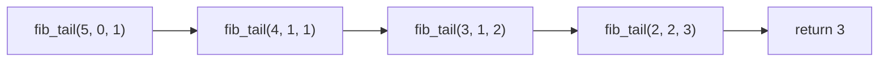

# Hello Algorithm notes

书本链接：[下载](https://github.com/krahets/hello-algo/releases/) \| [在线阅读](https://www.hello-algo.com/chapter_hello_algo/)


全书内容

- 复杂度分析
- 数据结构
- 算法

## 初识算法

- **算法**是*在有限时间内解决特定问题的一组指令或操作步骤*
  - 问题包含清晰的输入和输出定义
  - 能够在有限步骤、时间和内存空间下完成
  - 在相同的输入和运行条件下，输出始终相同
- **数据结构**是*组织和存储数据的方式*，涵盖数据内容、数据之间关系和数据操作方法。目标包括
  - 空间占用要少，以节省内存
  - 数据操作要快，包括数据访问、添加、删除、更新等
  - 数据表示简洁，逻辑信息简洁，好让算法高效
- 注意数据结构与算法高度相关，比如采取图的结构和链表的结构，都可以从输入得到所需输出，但是算法设计就不同，且在访问速度和内存占用上有别


## 复杂度分析 Complexiy Analysis

算法效率的衡量维度

- **时间效率**：*算法运行时间的长短*
- **空间效率**：*算法占用内存空间的大小*

评估方法<a id="复杂度分析-实测"> </a>

- 实际测试(局限性大)
  - 测试环境会有干扰，比如是否适合并行
  - 消耗资源，因为输入数据量大大小会影响算法效率的结论，故需要测试各种规模的输入数据
- 理论估算：(渐近)复杂度分析
  - 可以计算算法在理论上的时间复杂度和空间复杂度
  - 高效

分析算法复杂度涉及循环执行某段代码，下面介绍迭代和递归，两种重复的方法。

- 迭代：从第一步，第二步，一步一步往上走，直到\\(n\\)
- 递归，为了到达\\(n\\)，那么要先到达\\(n-1\\)，一直如此直到拆解到第一步

### 迭代 Iteration

**迭代**是*一种重复执行某个任务的控制结构*。程序会在满足一定的条件下循环执行某段代码，直到这个条件不再满足。

- for循环，在预先知道迭代次数上限时使用
- while循环，程序每轮都会先检查条件，如果条件为真，则继续执行，否则就结束循环。循环内部会更新条件变量
- 循环套循环

示例：\\(1+2+3+\cdots+n\\)，\\(\sum_{i=1}^n\sum_{j=1}^n f(i,j)\\)

<details markdown="1" data-auto-footer>
<summary>循环计算示例</summary>

```python
def for_loop(n: int) -> int:
    """for 循环"""
    res = 0 # result初始化结果变量
    for i in range(1, n + 1):
        res += i
    return res

def while_loop(n: int) -> int:
    """while 循环"""
    res = 0
    i = 1  # 初始化条件变量
    while i <= n:
        res += i
        i += 1  # 更新条件变量
    return res

def nested_for_loop(n: int) -> str:
    """双层 for 循环"""
    res = 0
    # 循环 i = 1, 2, ..., n-1, n
    for i in range(1, n + 1):
        # 循环 j = 1, 2, ..., n-1, n
        for j in range(1, n + 1):
            res += f({i}, {j})
    return res
```
</details>

### 递归 Recursion

**递归**是*一种算法策略，通过函数调用自身来解决问题。*

- 递：程序不断深入地调用自身，通常传入更小或更简化的参数，直到达到"终止条件"
- 归：触发"终止条件"后，程序从最深层的递归函数开始逐层返回，汇聚每一层的结果

普通递归示例：\\(1+2+3+\cdots+n\\)

<details markdown="1" data-auto-footer>
<summary>递归示例</summary>

```python
def recur(n: int) -> int:
    """递归"""
    # 终止条件
    if n == 1:
        return 1
    # 递：递归调用
    res = recur(n - 1)
    # 归：返回结果
    return n + res
```
</details>


递归的特点就是每次调用自身，但是会在内存中记录当前的调用，称为"栈帧空间"。比如`recur(5)`就会凭空产生`recur(5)`，`recur(4)`，`recur(3)`，`recur(2)`，`recur(1)`，所以更耗费内存。且由于涉及函数调用，所以比循环更废时间。为此定义**递归深度**：*在触发终止条件前，同时存在的未返回的递归函数个数*。过深的递归可能导致栈溢出错误。

这段代码的存栈过程和空间释放过程可以用下面这段代码理解。

<details markdown="1" data-auto-footer>
<summary>数组模拟递归</summary>

```python
def for_loop_recur(n: int) -> int:
    """使用数组模拟递归"""
    # 使用一个显式的栈来模拟系统调用栈
    stack = []
    res = 0
    # 递：递归调用
    for i in range(n, 0, -1):
        # 通过"入栈操作"模拟"递"
        stack.append(i)
    # 此时stack = [n, n-1, ... 1]
    # 归：返回结果
    while stack:
        # 通过"出栈操作"模拟"归"
        res += stack.pop()
    # res = 1+2+3+...+n
    return res
```
</details>


#### 尾递归 Tail Recursion

定义**尾递归**：*如果函数在返回前的最后一步才进行递归调用*，则该函数可以被编译器或解释器优化，使其在空间效率上与迭代相当。通过示例分析一下

<details markdown="1" data-auto-footer>
<summary>尾递归示例</summary>

```python
def tail_recur(n, res=0):
    """尾递归"""
    # 终止条件
    if n == 0:
        return res
    # 尾递归调用
    res += n
    return tail_recur(n - 1, res)
```
</details>


之前的代码的return可以简写为`return n+recur(n - 1)`，所以递归调用recur(n - 1)返回后，还要再做一次加法运算`+n`。尾递归的代码是先计算`+n`，再return。模拟如下

<details markdown="1" data-auto-footer>
<summary>显式栈模拟尾递归</summary>

```python
def tail_recur_stack(n: int) -> int:
    """使用显式栈模拟尾递归"""
    stack = [(n, 0)]  # 保存 (n, res)，初始 res=0
    res = 0
    while stack:
        n, res = stack.pop()
        if n == 0:
            return res
        # 尾递归：只需更新参数后再压栈
        stack.append((n - 1, res + n))
```
</details>


尾递归中，函数返回到上一层级后，无须继续执行其他操作，因此系统无须保存上一层函数的上下文。但是Python不支持。

#### 递归树 Recursion Tree

示例：求斐波那契数列\\(f(n) = f(n-1)+f(n-2),f(1)=0,f(2)=1\\)。这种的也可以尾递归优化。

<details markdown="1" data-auto-footer>
<summary>递归，尾递归求斐波那契数列</summary>

```python
def fib(n: int) -> int:
    """斐波那契数列：递归"""
    # 终止条件 f(1) = 0, f(2) = 1
    if n == 1 or n == 2:
        return n - 1
    # 递归调用 f(n) = f(n-1) + f(n-2)
    res = fib(n - 1) + fib(n - 2)
    # 返回结果 f(n)
    return res

def fib_tail(n: int, a: int = 0, b: int = 1) -> int:
    """
    尾递归版本斐波那契
    a = f(1), b = f(2)
    """
    if n == 1:
        return a
    if n == 2:
        return b
    return fib_tail(n - 1, b, a + b)
```
</details>

前者产生深度为n的递归树


后者的调用过程与普通尾递归类似，是一串



### 时间复杂度 Time Complexity

直接运行计算时间，如[前所述](#复杂度分析-实测)不现实。**时间复杂度**分析统计的不是算法运行时间，定义为：*算法运行时间随着数据量变大时的增长趋势*。定义**函数渐近上界**：*给定一个输入大小为\\(n\\)的函数，算法的操作数量是一个关于输入数据大小\\(n\\)的函数，记为\\(T(n)\\)。若存在正实数\\(c\\)和实数\\(n_0\\)，使得对于所有的\\(n > n_0\\)，均有\\(T(n) \leq c \cdot f(n)\\)，则可认为\\(f(n)\\)给出了\\(T(n)\\)的一个渐近上界，记为\\(T(n) = O(f(n))\\)。*


1. 常数阶\\(O(1)\\)：\\(T(n)=1,T(n)=100000\\)，循环次数，运算次数都和输入数据大小无关
2. 对数阶\\(O(\log(n))\\)：\\(T(n)=\log_2(n)\\)，常见于运算次数在每个循环中减半的情况，比如一些递归函数
3. 线性阶\\(O(n)\\)：\\(T(n)=n,T(n)=3n+2\\)，常见于单层循环，总运算次数相对于输入数据大小以线性级别增长
4. 线性对数阶\\(O(n\log(n))\\)：\\(T(n)=1,T(n)=100000\\)，常见于嵌套循环。一个\\(O(n)\\)套一个\\(O(\log(n))\\)
5. 平方阶\\(O(n^2)\\)：\\(T(n)=1,T(n)=100000\\)，常见于嵌套循环。一个\\(O(n)\\)套一个\\(O(n)\\)
6. 指数阶\\(O(2^n)\\)：\\(T(n)=1,T(n)=100000\\)，常见于运算次数在每个循环加倍的情况，比如计算递归树
7. 阶乘阶\\(O(n!)\\)：\\(T(n)=1,T(n)=100000\\)，常见于运算次数在每个循环翻倍，倍数为上一个循环的运算次数减去一个常数


<details markdown="1" data-auto-footer>
<summary>示例代码</summary>

```python
def constant(n: int) -> int:
    """常数阶"""
    count = 0
    size = 100000
    for _ in range(size):
        count += 1
    return count
def logarithmic(n: int) -> int:
    """对数阶(循环实现)"""
    count = 0
    while n > 1:
        n = n / 2
        count += 1
    return count
def log_recur(n: int) -> int:
    """对数阶(递归实现)"""
    if n <= 1:
        return 0
    return log_recur(n / 2) + 1
def linear(n: int) -> int:
    """线性阶"""
    count = 0
    for _ in range(n):
        count += 1
    return count
def array_traversal(nums: list[int]) -> int:
    """线性阶(遍历数组)"""
    count = 0
    # 循环次数与数组长度成正比
    for num in nums:
        count += 1
    return count

def linear_log_recur(n: int) -> int:
    """线性对数阶"""
    if n <= 1:
        return 1
    # 一分为二，子问题的规模减小一半
    count = linear_log_recur(n // 2) + linear_log_recur(n // 2)
    # 当前子问题包含 n 个操作
    for _ in range(n):
        count += 1
    return count
def quadratic(n: int) -> int:
    """平方阶"""
    count = 0
    # 循环次数与数据大小 n 成平方关系
    for i in range(n):
        for j in range(n):
            count += 1
    return count
def bubble_sort(nums: list[int]) -> int:
    """平方阶(冒泡排序)"""
    count = 0  # 计数器
    # 外循环：未排序区间为 [0, i]
    for i in range(len(nums) - 1, 0, -1):
        # 内循环：将未排序区间 [0, i] 中的最大元素交换至该区间的最右端
        for j in range(i):
            if nums[j] > nums[j + 1]:
                # 交换 nums[j] 与 nums[j + 1]
                tmp: int = nums[j]
                nums[j] = nums[j + 1]
                nums[j + 1] = tmp
                count += 3  # 元素交换包含 3 个单元操作
    return count

def exponential(n: int) -> int:
    """指数阶(循环实现)"""
    count = 0
    base = 1
    # 细胞每轮一分为二，形成数列 1, 2, 4, 8, ..., 2^(n-1)
    for _ in range(n):
        for _ in range(base):
            count += 1
        base *= 2
    # count = 1 + 2 + 4 + 8 + .. + 2^(n-1) = 2^n - 1
    return count
def exp_recur(n: int) -> int:
    """指数阶(递归实现)"""
    if n == 1:
        return 1
    return exp_recur(n - 1) + exp_recur(n - 1) + 1
def factorial_recur(n: int) -> int:
    """阶乘阶(递归实现)"""
    if n == 0:
        return 1
    count = 0
    # 从 1 个分裂出 n 个
    for _ in range(n):
        count += factorial_recur(n - 1)
    return count
```
</details>


算法的时间效率往往不是固定的，而是与输入数据的分布有关。为此定义算法的**最差时间复杂度**为\\(O(n)\\)，**最佳时间复杂度**为\\(\Omega(n)\\)。最简单的例子，在数组中寻找元素\\(1\\)出现的第一个索引。数组如果第一个元素就是\\(1\\)，就达到了最佳时间复杂度；若仅有一个元素\\(1\\)且排在最后，那就达到最差时间复杂度。在随机输入数据下的运行效率则定义为**平均时间复杂度**，使用记号\\(\Theta(n)\\)。

### 空间复杂度 Space Complexity

**空间复杂度**用于*衡量算法占用内存空间随着数据量变大时的增长趋势*。

- 输入空间：用于存储算法的输入数据
- 暂存空间：用于存储算法在运行过程中的变量、对象、函数上下文等数据
  - 暂存数据：用于保存算法运行过程中的各种常量、变量、对象等
  - 栈帧空间：用于保存调用函数的上下文数据。系统在每次调用函数时都会在栈顶部创建一个栈帧，函数返回后，栈帧空间会被释放
  - 指令空间：用于保存编译后的程序指令，在实际统计中通常忽略不计
- 输出空间：用于存储算法的输出数据

计算时，一般统计暂存数据、栈帧空间和输出数据三部分。因为内存空间是一项硬性要求，通常只关注最差空间复杂度：

- 输入数据情况最差，比如说真要是循环起来，一定要到最后一个元素
- 以算法运行中的峰值内存为准

<details markdown="1" data-auto-footer>
<summary>示例代码</summary>

```python
def function() -> int:
    # 执行某些操作
    return 0

def loop(n: int):
    """循环的空间复杂度为 O(1)"""
    for _ in range(n):
        function()

def recur(n: int):
    """递归的空间复杂度为 O(n)"""
    if n == 1:
        return
    return recur(n - 1)
```
</details>

|函数|时间复杂度|空间复杂度|
|:-|:-|:-|
|loop|\\(O(n)\\)|\\(O(1)\\)，每次循环不占用栈帧空间|
|recur|\\(O(n)\\)|\\(O(n)\\)，每次循环栈帧空间+1|

常见类型如下

1. 常数阶\\(O(1)\\)：各个对象变量都和输入数据大小无关，对于支持尾递归优化的变成语言，其空间复杂度也是\\(O(1)\\)。不过绝大多数编程语言(例如 Java、Python、C++、Go、C# 等)不支持自动优化尾递归。
2. 对数阶\\(O(\log(n))\\)：常见于分治算法，例如归并排序，
3. 线性阶\\(O(n)\\)：常见于元素数量与\\(n\\)成正比的数组、链表、栈、队列等
4. 平方阶\\(O(n^2)\\)：常见于矩阵和图，元素数量与\\(n\\)成平方关系
5. 指数阶\\(O(2^n)\\)：常见于常见于二叉树

<details markdown="1" data-auto-footer>
<summary>示例代码</summary>

```python
def linear(n: int):
    """线性阶"""
    # 长度为 n 的列表占用 O(n) 空间
    nums = [0] * n
    # 长度为 n 的哈希表占用 O(n) 空间
    hmap = dict[int, str]()
    for i in range(n):
        hmap[i] = str(i)
def linear_recur(n: int):
    """线性阶(递归实现)"""
    print("递归 n =", n)
    if n == 1:
        return
    linear_recur(n - 1)
def quadratic(n: int):
    """平方阶"""
    # 二维列表占用 O(n^2) 空间
    num_matrix = [[0] * n for _ in range(n)]
def quadratic_recur(n: int) -> int:
    """平方阶(递归实现)"""
    if n <= 0:
        return 0
    # 数组 nums 长度为 n, n-1, ..., 2, 1
    nums = [0] * n
    return quadratic_recur(n - 1)

def build_tree(n: int) -> TreeNode | None:
    """指数阶(建立满二叉树)"""
    if n == 0:
        return None
    root = TreeNode(0)
    root.left = build_tree(n - 1)
    root.right = build_tree(n - 1)
    return root
def merge_sort(nums: list[int]) -> list[int]:
    """普通实现：归并排序(迭代版，自底向上)"""
    n = len(nums)
    size = 1
    while size < n:
        for left in range(0, n - size, size * 2):
            mid = left + size
            right = min(left + size * 2, n)
            nums[left:right] = merge(nums[left:mid], nums[mid:right])
        size *= 2
    return nums
def merge_sort_recur(nums: list[int]) -> list[int]:
    """递归实现：归并排序(自顶向下)"""
    if len(nums) <= 1:
        return nums
    mid = len(nums) // 2
    left = merge_sort_recur(nums[:mid])
    right = merge_sort_recur(nums[mid:])
    return merge(left, right)

def merge(left: list[int], right: list[int]) -> list[int]:
    res = []
    i = j = 0
    while i < len(left) and j < len(right):
        if left[i] <= right[j]:
            res.append(left[i]); i += 1
        else:
            res.append(right[j]); j += 1
    res.extend(left[i:])
    res.extend(right[j:])
    return res
```
</details>


归并排序的递归树图


优化时，降低时间复杂度通常需要以提升空间复杂度为代价，反之亦然，鱼与熊掌不可兼得。在大多数情况下，时间比空间更宝贵，因此"以空间换时间"通常是更常用的策略。若是在数据量很大的情况下，控制空间复杂度也非常重要。

## 数据结构 Data Structure

### 数据结构分类

依据逻辑结构分类

- 线性数据结构：数组、链表、栈、队列、哈希表，元素之间是一对一的顺序关系
- 非线性数据结构
  - 树形结构：树、堆、哈希表，元素之间是一对多的关系
  - 网状结构：图，元素之间是多对多的关系


依据物理结构分类

- 连续空间存储(数组)，可实现：栈、队列、哈希表、树、堆、图、矩阵、张量(维度\\(\geq 3\\)的数组)等。数组在初始化后长度不可变，是静态数据结构，除非重新分配内存。
- 分散空间存储(链表)，可实现：栈、队列、哈希表、树、堆、图等。链表在初始化后，仍可以在程序运行过程中对其长度进行调整，是动态数据结构。

当算法程序运行时，正在处理的数据主要存储在内存中。系统通过内存地址来访问目标位置的数据。


某块内存若被程序一占用，通常无法被其他程序同时使用了。因此算法在涉及时要考虑内存资源

- 占用的内存峰值
- 若缺少连续大块的内存空间，考虑链表

### 基本数据类型

- 整数类型 `byte`、`short`、`int`、`long`
- 浮点数类型 `float`、`double` ，用于表示小数
- 字符类型 `char` ，用于表示各种语言的字母、标点符号甚至表情符号等
- 布尔类型 `bool` ，用于表示"是"与"否"判断

存储方式为二进制，一个二进制位占1比特。大多情况，1字节由8比特组成。在Java中

| 类型   | 符号     | 占用空间 | 最小值                   | 最大值                  | 默认值         |
| -- | ---- | ---- | ---- | --- | -- |
| 整数   | `byte`   | 1 字节   | \\(-2^7\\) (\\(-128\\))      | \\(2^7 - 1\\) (\\(127\\))     |\\(0\\)            |
|        | `short`  | 2 字节   | \\(-2^{15}\\)               | \\(2^{15} - 1\\)            | \\(0\\)            |
|        | `int`    | 4 字节   | \\(-2^{31}\\)               | \\(2^{31} - 1\\)            | \\(0\\)            |
|        | `long`   | 8 字节   | \\(-2^{63}\\)               | \\(2^{63} - 1\\)            | \\(0\\)            |
| 浮点数 | `float`  | 4 字节   | \\(1.175 \times 10^{-38}\\)  | \\(3.403 \times 10^{38}\\)  | \\(0.0\text{f}\\)  |
|        | `double` | 8 字节   | \\(2.225 \times 10^{-308}\\)| \\(1.798 \times 10^{308}\\) | \\(0.0\\)          |
| 字符   | `char`   | 2 字节   | \\(0\\)                      | \\(2^{16} - 1\\)            | \\(0\\)            |
| 布尔   | `bool`   | 1 字节   | \\(\text{false}\\)           |\\(\text{true}\\)           | \\(\text{false}\\) |

- 现代计算机 CPU 通常将 1 字节作为最小寻址内存单元。所以布尔量，尽管只要1比特，也存储为1字节
- 不同编程语言的存储数据方式不尽相同

### 数字编码

因为计算机内硬件电路主要是基于加法运算设计的，所以需要特殊的编码方式，来适应这种计算方式，可以简化硬件设计，提高运算效率。为此定义

- **原码(sign-magnitude)**：数字的二进制表示的最高位视为符号位，其中\\(0\\)表示正数，\\(1\\)表示负数，其余位表示数字的值
- **反码(1's complement)**：正数的反码与其原码相同，负数的反码是对其原码除符号位外的所有位取反
- **补码(2's complement)**：正数的补码与其原码相同，负数的补码是在其反码的基础上加\\(1\\)


为什么不用原码？负数的原码不能直接用于运算。示例：计算\\(1+(-2)\\)。其中\\(\rightarrow\\)表示进制转换

$$
\begin{array}{clll}
& 1 &+ &(-2) \newline
\rightarrow&  0000 \; 0001 &+ &1000 \; 0010 \newline
= & 1000 \; 0011 &&\newline
\rightarrow& -3&&
\end{array}
$$

因此引入反码

$$
\begin{array}{clll}
& 1 &+ &(-2) \newline
\rightarrow&  0000 \; 0001 \; \text{(原码)} &+& 1000 \; 0010 \; \text{(原码)} \newline
=&  0000 \; 0001 \; \text{(反码)} &+& 1111  \; 1101 \; \text{(反码)} \newline
=&  1111 \; 1110 \; \text{(反码)}&& \newline
=&  1000 \; 0001 \; \text{(原码)}&& \newline
\rightarrow&  -1&&
\end{array}
$$

另一个问题就是\\(0\\)的表示。原码和反码中\\(0\\)有两种表示：\\(+0\\)和\\(-0\\)。所以在反码之上，再加一得到补码。如此\\(0\\)的表示统一

$$
\begin{array}{cccl}
-0 &\rightarrow& \; & 1000 \; 0000 \; \text{(原码)} \newline
&=& \; & 1111 \; 1111 \; \text{(反码)} \newline
&=& 1\text{(溢出)} \; & 0000 \; 0000 \; \text{(补码)} \newline
&\rightarrow&&+0
\end{array}
$$

溢出的那一位会被舍弃。而在补码下，会有一个码没有对应的原码 \\(1000 \; 0000\\)，计算机规定这个代表\\(-128\\)。这也符合运算逻辑

$$
\begin{array}{clll}
& (-127) &+& (-1) \newline
\rightarrow&  1111 \; 1111 \; \text{(原码)} &+& 1000 \; 0001 \; \text{(原码)} \newline
=& 1000 \; 0000 \; \text{(反码)} &+& 1111  \; 1110 \; \text{(反码)} \newline
=& 1000 \; 0001 \; \text{(补码)} &+& 1111  \; 1111 \; \text{(补码)} \newline
=& 1\text{(溢出)} \;1000 \; 0000 \; \text{(补码)} &&\newline
\rightarrow&  -128 &&
\end{array}
$$

#### 浮点数编码

记一个4字节，32比特长度的二进制数为：\\(b_{31} b_{30} b_{29} \ldots b_2 b_1 b_0\\)。根据IEEE 754标准，

|名称|占位数|对应|范围|
|:-:|:-:|:-:|:-:|
|符号位 \\(\mathrm{S}\\)|1 |\\(b_{31}\\)|\\(\{ 0, 1\}\\)|
|指数位 \\(\mathrm{E}\\)|8 |\\(b_{30} b_{29} \ldots b_{23}\\)|\\(\{ 1, 2, \dots, 254 \}\\)|
|分数位 \\(\mathrm{N}\\)|23|\\(b_{22} b_{21} \ldots b_0\\)|\\(\sum_{i=1}^{23} b_{23-i} 2^{-i} \subset [0, 1 - 2^{-23}]\\)|

二进制数 `float` 对应值的计算方法为：

$$
\begin{array}{rlll}
\text{value}
&= (-1)^{b_{31}} &\times 2^{\left(b_{30} b_{29} \ldots b_{23}\right)_2-127} &\times\left(1 . b_{22} b_{21} \ldots b_0\right)_2\\
&=(-1)^{\mathrm{S}} &\times 2^{\mathrm{E} -127} &\times (1 + \mathrm{N})
\end{array}
$$

示例


尽管浮点数 `float` 扩展了取值范围，但其副作用是牺牲了精度。整数类型 `int` 将全部 32 比特用于表示数字，数字是均匀分布的；而由于指数位的存在，浮点数 `float` 的数值越大，相邻两个数字之间的差值就会趋向越大。

| 指数位 E           | 分数位 \\(\mathrm{N} = 0\\) | 分数位 \\(\mathrm{N} \ne 0\\) | 计算公式                                                               |
| -- | --- | - | ------ |
| \\(0\\)                | \\(\pm 0\\)            | 次正规数                 | \\((-1)^{\mathrm{S}} \times 2^{-126} \times (0.\mathrm{N})\\)              |
| \\(1, 2, \dots, 254\\) | 正规数                  | 正规数                   | \\((-1)^{\mathrm{S}} \times 2^{(\mathrm{E} -127)} \times (1.\mathrm{N})\\) |
| \\(255\\)              | \\(\pm \infty\\)       | \\(\mathrm{NaN}\\)      |                                                                        |

### 字符编码

从二进制数到字符需要一种一一对应的表，常见的有以下字符集。

#### ASCII 字符集

最早的字符集，American Standard Code for Information Interchange。它使用7位二进制数(一个字节的低7位)表示一个字符，最多能够表示128个不同的字符。如下图所示，ASCII码包括英文字母的大小写、数字0~9、一些标点符号，以及一些控制字符(如换行符和制表符)。


之后为囊括五湖四海的字符，拓展为EASCII字符集，GB2312字符集，GBK字符集，Unicode字符集。

#### Unicode 字符集

在Unicode 字符集中，常用的字符占用2字节，有些生僻的字符占用3字节甚至4字节。其本质，是给每个字符分配一个编号。但是当多种长度的Unicode码点同时出现在一个文本中时，系统如何解析字符？一种直接的解决方案是将所有字符存储为等长的编码，高位填充0，所有字符都编码为2字节。但是编码英文只需1字节，如ASCII码，非常浪费内存空间，不够高效。


#### UTF-8 编码

一种可变长度的编码，ASCII字符只需1字节，拉丁字母和希腊字母需要2字节，常用的中文字符需要3字节，其他的一些生僻字符需要4字节。

- 对于长度为1字节的字符，将最高位设置为0，其余7位设置为Unicode编号。ASCII字符在Unicode字符集中占据了前128个码点。也就是说，UTF-8编码可以向下兼容ASCII码
- 对于长度为\\(n>1\\)字节的字符，将首个字节的高\\(n\\)位都设置为\\(1\\)，第\\(n+1\\)位设置为\\(0\\)；从第二个字节开始，将每个字节的高2位都设置为\\(10\\)；其余所有位用于填充字符的 Unicode码点。


此处\\(10\\)作为校验，不可能有字符的最高两位是\\(10\\)，否则说明该字符的长度为\\(1\\)，对应ASCII码，但是ASCII码的最高位是\\(0\\)。

类似UTF-8，还有UTF-16和UTF-32。UTF-16使用2或4字节来表示一个字符。所有的ASCII字符和常用的非英文字符，都用2字节表示；少数字符需要用到4字节表示。对于2字节的字符，UTF-16编码与Unicode编号相等，对于中文，UTF-16更高效，仅用2字节，而UTF-8则需要3字节。至于UTF-32，每个字符都使用4字节。

#### 编程语言的字符编码

大多数编程语言，程序运行中的字符串都采用UTF-16或UTF-32这类等长编码，如此可以将字符串看作数组来处理。优势

- 随机访问：UTF-16编码的字符串可以快速随机访问。对于变长编码比如UTF-8，要想找到第\\(i\\)个字符，我们需要从开始处遍历到第\\(i\\)个字符，这需要\\(O(n)\\)的时间
- 字符计数：与随机访问类似，计算UTF-16编码的字符串的长度也是\\(O(1)\\)的操作。但是，计算UTF-8编码的字符串的长度需要遍历整个字符串
- 字符串操作：在UTF-16编码的字符串上，很多字符串操作(如分割、连接、插入、删除等)更容易进行。若采用UTF-8编码，则还需要额外的计算，以确保不会产生无效的UTF-8编码

注意字符串如何在文件中存储或在网络中传输是不同的问题。在文件存储或网络传输中，我们通常会将字符串编码为UTF-8格式，以达到最优的兼容性和空间效率。

## 数组与链表 Array and Linked List

### 数组 Array

**数组**，*一种线性数据结构，其将相同类型的元素存储在连续的内存空间中*，创建时要给定长度和元素类型。定义**元素索引(index)**，*元素在数组中的相对首位的增量*。


常见操作

- 初始化：大多数编程语言会将数组元素初始化为\\(0\\)
- 访问元素：索引是内存地址的偏移量，首个元素的地址偏移量是\\(0\\)，时间复杂度是\\(O(1)\\)
- 插入元素：将该索引之后的元素向后移动一位，之后再把元素赋值给该索引，时间复杂度是\\(O(n)\\)。为了避免末尾元素丢失，可以采用[链表](#链表)
- 删除元素：将该索引之后的元素向前移动一位，原先末尾的元素不用管，时间复杂度是\\(O(n)\\)
- 遍历数组：可以通过索引遍历数组，也可以直接遍历获取数组中的每个元素
- 查找元素：因为数组是线性数据，此处也称为线性查找。遍历数组，每轮判断匹配，若成功则输出索引
- 扩容数组：大多数编程语言中，数组长度不可变。扩容需重建一个更大的数组，然后把原数组元素依次复制到新数组，时间复杂度是\\(O(n)\\)

连续空间存储优点

- 空间效率高：数组为数据分配了连续的内存块，无须额外的结构开销
- 支持随机访问：数组允许在 \\(O(1)\\) 时间内访问任何元素
- 缓存局部性：当访问数组元素时，计算机不仅会加载它，还会缓存其周围的其他数据，从而借助高速缓存来提升后续操作的执行速度

连续空间存储缺点

- 插入与删除效率低：当数组中元素较多时，插入与删除操作需要移动大量的元素
- 长度不可变：数组在初始化后长度就固定了，扩容数组需要将所有数据复制到新数组，开销很大
- 空间浪费：如果数组分配的大小超过实际所需，那么多余的空间就被浪费了

基于此，设计如下应用(或者说，基于以下实际应用，数组这一数据结构存活)

- 随机访问：全数据存在数组中，并生成一个随机序列，根据索引实现随机抽样
- 排序和搜索：数组是排序和搜索算法最常用的数据结构。快速排序、归并排序、二分查找等都主要在数组上进行
- 查找表：当需要快速查找一个元素或其对应关系时，可以使用数组作为查找表。假如我们想实现字符到ASCII码的映射，则可以将字符的ASCII码值作为索引，对应的元素存放在数组中的对应位置
- 机器学习：神经网络中大量使用了向量、矩阵、张量之间的线性代数运算，这些数据都是以数组的形式构建的。数组是神经网络编程中最常使用的数据结构
- 数据结构实现：数组可以用于实现栈、队列、哈希表、堆、图等数据结构。例如，图的邻接矩阵表示实际上是一个二维数组

### 链表 Linked List

**链表**是*一种线性数据结构，其中的每个元素都是一个节点(node)对象，各个节点通过"引用"相连接。引用记录了下一个节点的内存地址，通过它可以从当前节点访问到下一个节点。每个节点都包含两项数据：节点的"值"和指向下一节点的"引用"。*头节点通常当作链表的代称。


常见操作

- 初始化：各个节点对象，并构建节点之间的引用/指向关系
- 插入节点：只需改变两个节点的引用(指针)即可，时间复杂度为\\(O(1)\\)
- 删除节点：只需改变一个节点的引用(指针)即可。剩下一个无法访问的节点，认为其脱离了链表
- 访问节点：需要从头开始一个一个找"引用"，时间复杂度为\\(O(n)\\)
- 查找节点：也是线性查找

总结

|          | 数组                           | 链表           |
| ---- | -- | -- |
| 存储方式 | 连续内存空间                   | 分散内存空间   |
| 容量扩展 | 长度不可变                     | 可灵活扩展     |
| 内存效率 | 元素占用内存少、但可能浪费空间 | 元素占用内存多 |
| 访问元素 | \\(O(1)\\)                       | \\(O(n)\\)       |
| 添加元素 | \\(O(n)\\)                       | \\(O(1)\\)       |
| 删除元素 | \\(O(n)\\)                       | \\(O(1)\\)       |

#### 常见链表类型

- 单向链表：如前所描述的。首个节点为头节点，最后一个节点为尾节点，尾节点指向空`None`
- 环形链表：再令单向链表的尾节点指向头节点。在环形链表中，任意节点都可以视作头节点
- 双向链表：记录了两个方向的引用。更灵活，也占用更多内存


<details markdown="1" data-auto-footer>
<summary>链表类构造示例</summary>

```python
class ListNode1:
    """链表节点类"""
    def __init__(self, val: int):
        self.val: int = val               # 节点值
        self.next: ListNode | None = None # 指向下一节点的引用
class ListNode2:
    """双向链表节点类"""
    def __init__(self, val: int):
        self.val: int = val                # 节点值
        self.next: ListNode | None = None  # 指向后继节点的引用
        self.prev: ListNode | None = None  # 指向前驱节点的引用
```
</details>


#### 典型链表应用

单向链表通常用于实现栈、队列、哈希表和图等数据结构

- **栈与队列**：当插入和删除操作都在链表的一端进行时，它表现的特性为先进后出or后进先出(First In Last Out FILO or LIFO)，对应栈；当插入操作在链表的一端进行，删除操作在链表的另一端进行，它表现的特性为先进先出(LILO or FIFO)，对应队列。参考下图

<svg viewBox="0 0 900 600" width="100%" style="height:auto;max-width:900px" xmlns="http://www.w3.org/2000/svg">
  <defs>
    <marker id="arrow" markerWidth="6" markerHeight="6" refX="5" refY="3" orient="auto">
      <path d="M0,0 L6,3 L0,6 z" fill="#222"/>
    </marker>
    <style>
      .ball { fill: #fff; stroke: #222; stroke-width: 3; }
      .label { font: 16px/1.2 sans-serif; fill: #222; text-anchor: middle; dominant-baseline: middle; }
      .box   { fill: #fff; stroke: #222; stroke-width: 3; }
      .title { font: bold 18px sans-serif; fill: #222; text-anchor: middle; }
    </style>
  </defs>

  <!-- ===== 上：栈 Stack (LIFO) ===== -->
  <text x="450" y="30" class="title">Stack (LIFO)</text>
  <circle cx="450" cy="90"  r="25" class="ball"/><text x="450" y="90"  class="label">3</text>
  <circle cx="450" cy="140" r="25" class="ball"/><text x="450" y="140" class="label">2</text>
  <circle cx="450" cy="190" r="25" class="ball"/><text x="450" y="190" class="label">1</text>
  <text x="370" y="75" class="label">In</text>
  <path d="M385,75 L425,88" stroke="#222" stroke-width="3" marker-end="url(#arrow)"/>
  <text x="530" y="75" class="label">Out</text>
  <path d="M475,88 L515,75" stroke="#222" stroke-width="3" marker-end="url(#arrow)"/>

  <!-- 分隔线 -->
  <line x1="60" y1="270" x2="840" y2="270" stroke="#222" stroke-width="1" stroke-dasharray="4 6"/>

  <!-- ===== 下：队列 Queue (FIFO) ===== -->
  <text x="450" y="310" class="title">Queue (FIFO)</text>
  <!-- 上排：入队 -->
  <rect x="255" y="350" width="350" height="60" class="box"/>
  <circle cx="565" cy="380" r="25" class="ball"/><text x="565" y="380" class="label">1</text>
  <circle cx="500" cy="380" r="25" class="ball"/><text x="500" y="380" class="label">2</text>
  <circle cx="375" cy="380" r="25" class="ball"/><text x="375" y="380" class="label">3</text>
  <text x="280" y="380" class="label">In</text>
  <path d="M295,380 L335,380" stroke="#222" stroke-width="3" marker-end="url(#arrow)"/>

  <!-- 下排：出队 -->
  <rect x="255" y="430" width="350" height="60" class="box"/>
  <circle cx="565" cy="460" r="25" class="ball"/><text x="565" y="460" class="label">1</text>
  <circle cx="500" cy="460" r="25" class="ball"/><text x="500" y="460" class="label">2</text>
  <circle cx="435" cy="460" r="25" class="ball"/><text x="435" y="460" class="label">3</text>
  <text x="650" y="460" class="label">Out</text>
  <path d="M590,460 L630,460" stroke="#222" stroke-width="3" marker-end="url(#arrow)"/>
</svg>

- **哈希表**：链式地址是解决哈希冲突的主流方案之一，在该方案中，所有冲突的元素都会被放到一个链表中
- **图**：邻接表是表示图的一种常用方式，其中图的每个顶点都与一个链表相关联，链表中的每个元素都代表与该顶点相连的其他顶点

双向链表常用于需要快速查找前一个和后一个元素的场景

- **高级数据结构**：比如在红黑树、B树中，我们需要访问节点的父节点，这可以通过在节点中保存一个指向父节点的引用来实现，类似于双向链表
- **浏览器历史**：点击前进或后退按钮时，浏览器需要知道用户访问过的前一个和后一个网页
- **LRU 算法**：在缓存淘汰(Least Recently Used, LRU)算法中，我们需要快速找到最近最少使用的数据，以及支持快速添加和删除节点

环形链表常用于需要周期性操作的场景，比如操作系统的资源调度

- **时间片轮转调度算法**：一种常见的CPU调度算法，对一组进程进行循环。每个进程被赋予一个时间片，当时间片用完时，CPU将切换到下一个进程
- **数据缓冲区**：比如在音频、视频播放器中，数据流可能会被分成多个缓冲块并放入一个环形链表，以便实现无缝播放

### 列表 List (Dynamic Array)

**列表**，*表示元素的有序集合*，一个抽象概念。链表天然可以看作一个列表，其支持元素增删查改操作，并且可以灵活动态扩容。数组是一个具有长度限制的列表，为此设计动态数组(dynamic array)。继承了数组的各项优点，在加上可以进行动态扩容

列表常用操作

- 初始化："无初始值"和"有初始值"
- 访问元素：本质还是数组，时间复杂度\\(O(1)\\)
- 插入与删除元素：若是在尾部，时间复杂度\\(O(1)\\)，正常插入和删除元素的时间复杂度是\\(O(n)\\)
- 遍历：根据索引or直接遍历
- 拼接：两个列表首尾相连(好像链表啊)
- 排序

#### 列表实现

许多编程语言内置了列表(动态数组)比如Python，实现较为复杂。一般要有以下几点设计

- 初始容量：选取一个合理的数组初始容量
- 数量记录：声明一个变量 `size` ，用于记录列表当前元素数量，并随着元素插入和删除实时更新。根据此变量，我们可以定位列表尾部，以及判断是否需要扩容
- 扩容机制：若插入元素时列表容量已满，则需要进行扩容。可以扩容固定长or倍增，再将当前数组的所有元素依次移动至新数组

### 内存与缓存 Ram and Cache


|                | 硬盘 Hard Disk             | 内存  Random-Access Memory, RAM         | 缓存    Cache Memory                       |
| - | ---- | --- | -- |
| 用途           | 长期存储数据，包括操作系统、程序、文件等 | 临时存储当前运行的程序和正在处理的数据 | 存储经常访问的数据和指令，减少 CPU 访问内存的次数 |
| 易失性         | 断电后数据不会丢失                       | 断电后数据会丢失                       | 断电后数据会丢失                                  |
| 容量           | 较大，TB 级别                            | 较小，GB 级别                          | 非常小，MB 级别                                   |
| 速度           | 较慢，几百到几千 MB/s                    | 较快，几十 GB/s                        | 非常快，几十到几百 GB/s                           |
| 价格 | 较便宜                  | 较贵              | 非常贵                  |

计算机的存储层次结构体现了速度、容量和成本三者之间的精妙平衡。实际上，这种权衡普遍存在于所有工业领域，它要求我们在不同的优势和限制之间找到最佳平衡点。


#### 数据结构的内存效率

内存的限制

- 一块内存不能被多个程序共享
- 总量有限
- 程序运行中各种增删改查，一定会积累碎片化空闲内存

| 角度 | 数组 | 链表 |
|------|------|------|
| **空间利用** | 元素紧密排列，不需要额外指针，空间效率更高 | 每个节点需要存储指针，额外开销较大 |
| **内存分配** | 需要一次性分配连续空间，可能造成内存浪费；扩容成本高 | 以节点为单位动态分配和回收，更灵活 |
| **碎片化影响** | 连续存储方式，相对不容易导致碎片化 | 节点分散存储，频繁插入删除更容易导致碎片化 |

动态数组就是两种方式的折中。关于碎片的产生，AI总结如下(我也看不懂)：

| 操作/模式 (Operation/Pattern) | 碎片类型 (Fragment Type) | 机理摘要 (Mechanism) | 场景/示例 (Typical Scenario) |
|-----------------|------------------|----------------------|--------------------|
| 不同大小的分配与释放交错 (Interleaved alloc/free of different sizes) | 外部碎片 External | 空闲块大小不匹配，无法合并成大块 | 长期运行的服务，malloc/free 大小混杂 |
| 长短寿命对象交错 (Mixed long-/short-lived objects) | 外部碎片 External | 长寿命对象像"钉子"阻止周围空闲合并 | 缓存对象夹在临时对象之间 |
| 动态数组频繁扩容 (Frequent dynamic array reallocation) | 外部碎片 External | 旧块释放留下洞，新块需大连续空间 | `std::vector`/`ArrayList` 没有 reserve 的情况 |
| 节点式容器频繁插入/删除 (Frequent insert/delete in node-based containers) | 外部+内部 External+Internal | 每节点独立分配，地址分散+指针开销 | `std::list`, `std::map`, 树/图结构 |
| 高对齐分配 (High-alignment allocation, e.g. aligned_alloc) | 外部+内部 External+Internal | 对齐造成两侧留空隙 | SIMD/NUMA/DMA 缓冲 |
| 混合尺寸对象随机释放 (Mixed-size objects, random release order) | 外部碎片 External | 小块插入大块之间，释放顺序打乱合并 | 大对象和小对象混堆使用 |
| 大量 mmap/VirtualAlloc 小块 (Frequent small mmap/VirtualAlloc) | 外部碎片 External | 虚拟空间打洞，稀疏难合并 | 插件/JIT/内存映射文件 |
| Pinned/锁页内存 (Pinned or locked pages) | 外部碎片 External | 不能移动，阻断空闲合并 | GPU pinned mem, `mlock` |
| 线程本地缓存滞留 (Per-thread cache retention) | 外部碎片 External | 内存被困在线程缓存，无法全局合并 | tcmalloc/jemalloc 跨线程释放 |
| 自定义分配器不合并 (Custom allocator without coalescing) | 外部碎片 External | 释放仅挂链表，不合并邻接空闲块 | 简单 pool/arena 实现 |
| size class 不匹配 (Size class rounding mismatch) | 内部碎片 Internal | 分配向上取整到桶大小，浪费空间 | 129B 请求被分到 256B 桶 |
| 结构体对齐/填充 (Struct padding/alignment) | 内部碎片 Internal | 字段排列不佳或缓存行填充 | 并发队列/锁结构体 |
| 节点容器头部开销大 (Large per-node overhead) | 内部碎片 Internal | 节点有额外指针/元数据 | 链表/树节点存少量数据 |
| 大页/巨页 (HugePages) | 内部碎片 Internal | 粒度过大，部分未用区域浪费 | DB/高性能计算 2MB/1GB 页 |
| 容器容量冗余 (Over-reserved container capacity) | 内部碎片 Internal | capacity > size 长期闲置 | `vector` 未 shrink_to_fit |
| Arena/Page 内空洞 (Arena/Page holes) | 内部碎片 Internal | 区内零散空位无法跨区复用 | Python `pymalloc`, Java GC region |

#### 数据结构的缓存效率

缓存的限制：空间更小，速度超快。有**缓存未命中(Cache miss)**现象，即*CPU尝试访问的数据不在缓存中*，不得不去内存中寻找。这个直接影响CPU效率，也就是程序性能，为此定义**缓存命中率(cache hit rate)**：*CPU从缓存中成功获取数据的比例*。通常提高命中率的策略有

- 缓存行：缓存不是单个字节地存储与加载数据，而是以缓存行为单位。相比于单个字节的传输，缓存行的传输形式更加高效
- 预取机制：处理器会尝试预测数据访问模式(例如顺序访问、固定步长跳跃访问等)，并根据特定模式将数据加载至缓存之中
- 空间局部性：如果一个数据被访问，那么它附近的数据可能近期也会被访问。所以缓存在加载某一数据时，也会加载其附近的数据
- 时间局部性：如果一个数据被访问，那么它在不久的将来很可能再次被访问。所以缓存会保留最近访问过的数据

| 对比维度 | 数组 (Array) | 链表 (Linked List) |
|----------|--------------|---------------------|
| 缓存行利用 (Cache Line Usage) | 数据连续存储，缓存行中大部分数据有效 | 数据分散存储，缓存行中无效数据比例更高 |
| 预取机制 (Prefetching)| 访问模式可预测，CPU 易于预取下一批数据 | 节点位置随机，难以预测访问顺序 |
| 空间局部性 (Spatial Locality) | 高度集中，加载的数据附近很可能被访问 | 数据离散，局部性差 |
| 总体缓存效率 (Cache Efficiency) | 命中率更高，操作效率更佳 | 命中率较低，访问效率受限 |
| 适用场景 (Use Case) | 数据规模可估计，注重效率和随机访问，例如算法题、基于数组的栈 | 数据规模大且动态性高，预估困难时更合适，例如基于链表的栈 |

## 栈与队列 Stack and Queue

### 栈 Stack

一种遵循先入后出逻辑的线性数据结构，first in last out FILO, or LIFO，类似于在桌面上摞盘子。如果想取出底部的盘子，则需要先将上面的盘子依次移走。


入栈，出栈，访问栈顶元素的时间复杂度都是\\(O(1)\\)。

#### 栈的实现

|操作|链表|数组|
|:-:|:-:|:-:|
|初始|||
|`push()`|||
|`pop()`|||

|对比|时间效率|空间效率|
|:-:|:-:|:-:|
|链表|入栈/出栈无需扩容，效率稳定，但每次入栈需新建节点并修改指针，速度相对较慢，除非作为节点对象入栈|节点需额外存储指针，单个元素占用空间较大|
|数组|入栈/出栈在连续内存中完成，缓存友好，平均效率较高；但扩容时单次操作会\\(O(n)\\)|初始化及扩容可能分配多余空间，存在一定浪费|

<details markdown="1" data-auto-footer>
<summary>基于链表/数组实现栈的示例</summary>

```python
class LinkedListStack:
    """使用链表实现的栈"""

    def __init__(self):
        """构造方法"""
        self._peek: ListNode | None = None
        self._size: int = 0

    def size(self) -> int:
        """获取栈的长度"""
        return self._size

    def is_empty(self) -> bool:
        """判断栈是否为空"""
        return self._size == 0

    def push(self, val: int):
        """入栈"""
        node = ListNode(val)
        node.next = self._peek
        self._peek = node
        self._size += 1

    def pop(self) -> int:
        """出栈"""
        num = self.peek()
        self._peek = self._peek.next
        self._size -= 1
        return num

    def peek(self) -> int:
        """访问栈顶元素"""
        if self.is_empty():
            raise IndexError("栈为空")
        return self._peek.val

    def to_list(self) -> list[int]:
        """转化为列表用于打印"""
        arr = []
        node = self._peek
        while node:
            arr.append(node.val)
            node = node.next
        arr.reverse()
        return arr
class ArrayStack:
    """使用数组实现的栈"""

    def __init__(self):
        """构造方法"""
        self._stack: list[int] = []

    def size(self) -> int:
        """获取栈的长度"""
        return len(self._stack)

    def is_empty(self) -> bool:
        """判断栈是否为空"""
        return self.size() == 0

    def push(self, item: int):
        """入栈"""
        self._stack.append(item)

    def pop(self) -> int:
        """出栈"""
        if self.is_empty():
            raise IndexError("栈为空")
        return self._stack.pop()

    def peek(self) -> int:
        """访问栈顶元素"""
        if self.is_empty():
            raise IndexError("栈为空")
        return self._stack[-1]

    def to_list(self) -> list[int]:
        """返回列表用于打印"""
        return self._stack
```
</details>

典型应用有

- 浏览器中的后退与前进
- 软件中的撤销与重做
- 程序内存管理：每次调用函数时，系统都会在栈顶添加一个栈帧，用于记录函数的上下文信息。比如递归，向下递推阶段会不断执行入栈操作，而向上回溯阶段则会不断执行出栈操作。

### 队列 Queue

一种遵循先入先出逻辑的线性数据结构，first in first out FIFO, or LILO，类似于排队打饭，先到先吃。


入队，出队，访问队首元素的时间复杂度都是\\(O(1)\\)。

#### 队列的实现

|操作|链表|数组|
|:-:|:-:|:-:|
|初始|||
|`push()`|||
|`pop()`|||

数组由于删除首元素的时间复杂度为\\(O(n)\\)，需要一些巧妙的方法。如何避免？一个简单的例子如下：

| 操作        | 数组状态   | `front` | `size` | `rear= front+size` |
|-------------|------------|-------|------|------|
| 初始              | [ , ]      | 0     | 0    | 0    |
| 入队 1 于 index 0 | [1, ]      | 0     | 1    | 1    |
| 入队 2 于 index 1 | [1, 2]     | 0     | 2    | 2    |
| 出队 → 1         | [ , 2]     | 1     | 1    | 2    |
| 出队 → 2         | [ , ]      | 2     | 0    | 2    |

- 入队：将输入元素赋值给 `rear` 索引处，并将 `size` 增加 1 。
- 出队：只需将 `front` 增加 1 ，并将 `size` 减少 1 。
- 注意到，`front` 和 `rear` 整体都在增加，最后会导致无法入队。所以 `front` 或 `rear` 在越过数组尾部时，直接回到数组头部继续遍历，需要加上取余操作。

<details markdown="1" data-auto-footer>
<summary>使用链表/数组实现队列的示例</summary>

```python
class LinkedListQueue:
    """使用链表实现的队列"""

    def __init__(self):
        """构造方法"""
        self._front: ListNode | None = None  # 头节点 front
        self._rear: ListNode | None = None  # 尾节点 rear
        self._size: int = 0

    def size(self) -> int:
        """获取队列的长度"""
        return self._size

    def is_empty(self) -> bool:
        """判断队列是否为空"""
        return self._size == 0

    def push(self, num: int):
        """入队"""
        # 在尾节点后添加 num
        node = ListNode(num)
        # 如果队列为空，则令头、尾节点都指向该节点
        if self._front is None:
            self._front = node
            self._rear = node
        # 如果队列不为空，则将该节点添加到尾节点后
        else:
            self._rear.next = node
            self._rear = node
        self._size += 1

    def pop(self) -> int:
        """出队"""
        num = self.peek()
        # 删除头节点
        self._front = self._front.next
        self._size -= 1
        return num

    def peek(self) -> int:
        """访问队首元素"""
        if self.is_empty():
            raise IndexError("队列为空")
        return self._front.val

    def to_list(self) -> list[int]:
        """转化为列表用于打印"""
        queue = []
        temp = self._front
        while temp:
            queue.append(temp.val)
            temp = temp.next
        return queue

class ArrayQueue:
    """使用环形数组实现的队列"""

    def __init__(self, size: int):
        """构造方法"""
        self._nums: list[int] = [0] * size  # 用于存储队列元素的数组
        self._front: int = 0  # 队首指针，指向队首元素
        self._size: int = 0  # 队列长度

    def capacity(self) -> int:
        """获取队列的容量"""
        return len(self._nums)

    def size(self) -> int:
        """获取队列的长度"""
        return self._size

    def is_empty(self) -> bool:
        """判断队列是否为空"""
        return self._size == 0

    def push(self, num: int):
        """入队"""
        if self._size == self.capacity():
            raise IndexError("队列已满")
        # 计算队尾指针，指向队尾索引 + 1
        # 通过取余操作实现 rear 越过数组尾部后回到头部
        rear: int = (self._front + self._size) % self.capacity()
        # 将 num 添加至队尾
        self._nums[rear] = num
        self._size += 1

    def pop(self) -> int:
        """出队"""
        num: int = self.peek()
        # 队首指针向后移动一位，若越过尾部，则返回到数组头部
        self._front = (self._front + 1) % self.capacity()
        self._size -= 1
        return num

    def peek(self) -> int:
        """访问队首元素"""
        if self.is_empty():
            raise IndexError("队列为空")
        return self._nums[self._front]

    def to_list(self) -> list[int]:
        """返回列表用于打印"""
        res = [0] * self.size()
        j: int = self._front
        for i in range(self.size()):
            res[i] = self._nums[(j % self.capacity())]
            j += 1
        return res
```
</details>

| 实现方式       | 入队(push/append) | 出队(pop/popleft) | 访问队首(peek/front) | 时间复杂度 | 内存开销 | 优点 | 缺点 |
|----------------|--------------------|---------------------|------------------------|------------|----------|------|------|
| **链表实现**   | 在尾部插入，\\(O(1)\\)   | 删除头节点，\\(O(1)\\)    | 返回头节点，\\(O(1)\\)       | 稳定 \\(O(1)\\)  | 较高(额外指针) | 性能稳定；不需扩容；可动态增长 | 每个节点存储指针，额外占内存；实现复杂 |
| **数组/Deque** | 尾部追加，\\(O(1)\\)     | 头部弹出，\\(O(1)\\)      | 访问下标 0，\\(O(1)\\)       | 稳定 \\(O(1)\\)  | 较低     | 语言内置支持，写法简洁；内存连续，缓存友好 | 如果用普通数组，`pop(0)` 是 \\(O(n)\\)；需要扩容(动态数组场景) |

典型应用有

- 淘宝订单
- 各类待办事项需要先来后到，比如打印机，出餐

### 双向队列 Double-Ended Queue

允许在头部和尾部执行元素的添加或删除操作。


双向队列常用操作包括添加元素到队首，队尾或，从队首队尾访问或删除元素，都是\\(O(1)\\)

<details markdown="1" data-auto-footer>
<summary>使用链表/数组实现队列的示例</summary>

```python
from collections import deque

# 初始化双向队列
deq: deque[int] = deque()

# 元素入队
deq.append(2)      # 添加至队尾
deq.append(5)
deq.append(4)
deq.appendleft(3)  # 添加至队首
deq.appendleft(1)

# 访问元素
front: int = deq[0]  # 队首元素
rear: int = deq[-1]  # 队尾元素

# 元素出队
pop_front: int = deq.popleft()  # 队首元素出队
pop_rear: int = deq.pop()       # 队尾元素出队

# 获取双向队列的长度
size: int = len(deq)

# 判断双向队列是否为空
is_empty: bool = len(deq) == 0
```
</details>

#### 双向队列实现

|操作|基于双向链表的|基于(环形)数组|
|:-:|:-:|:-:|
|`Deque`     |||
|`push_last` |||
|`push_first` |||
|`pop_last` |||
|`pop_first` |||


<details markdown="1" data-auto-footer>
<summary>使用双向链表/环形数组实现双向队列的示例</summary>

```python
class ListNode:
    """双向链表节点"""

    def __init__(self, val: int):
        """构造方法"""
        self.val: int = val
        self.next: ListNode | None = None  # 后继节点引用
        self.prev: ListNode | None = None  # 前驱节点引用

class LinkedListDeque:
    """基于双向链表实现的双向队列"""

    def __init__(self):
        """构造方法"""
        self._front: ListNode | None = None  # 头节点 front
        self._rear: ListNode | None = None  # 尾节点 rear
        self._size: int = 0  # 双向队列的长度

    def size(self) -> int:
        """获取双向队列的长度"""
        return self._size

    def is_empty(self) -> bool:
        """判断双向队列是否为空"""
        return self._size == 0

    def push(self, num: int, is_front: bool):
        """入队操作"""
        node = ListNode(num)
        # 若链表为空，则令 front 和 rear 都指向 node
        if self.is_empty():
            self._front = self._rear = node
        # 队首入队操作
        elif is_front:
            # 将 node 添加至链表头部
            self._front.prev = node
            node.next = self._front
            self._front = node  # 更新头节点
        # 队尾入队操作
        else:
            # 将 node 添加至链表尾部
            self._rear.next = node
            node.prev = self._rear
            self._rear = node  # 更新尾节点
        self._size += 1  # 更新队列长度

    def push_first(self, num: int):
        """队首入队"""
        self.push(num, True)

    def push_last(self, num: int):
        """队尾入队"""
        self.push(num, False)

    def pop(self, is_front: bool) -> int:
        """出队操作"""
        if self.is_empty():
            raise IndexError("双向队列为空")
        # 队首出队操作
        if is_front:
            val: int = self._front.val  # 暂存头节点值
            # 删除头节点
            fnext: ListNode | None = self._front.next
            if fnext is not None:
                fnext.prev = None
                self._front.next = None
            self._front = fnext  # 更新头节点
        # 队尾出队操作
        else:
            val: int = self._rear.val  # 暂存尾节点值
            # 删除尾节点
            rprev: ListNode | None = self._rear.prev
            if rprev is not None:
                rprev.next = None
                self._rear.prev = None
            self._rear = rprev  # 更新尾节点
        self._size -= 1  # 更新队列长度
        return val

    def pop_first(self) -> int:
        """队首出队"""
        return self.pop(True)

    def pop_last(self) -> int:
        """队尾出队"""
        return self.pop(False)

    def peek_first(self) -> int:
        """访问队首元素"""
        if self.is_empty():
            raise IndexError("双向队列为空")
        return self._front.val

    def peek_last(self) -> int:
        """访问队尾元素"""
        if self.is_empty():
            raise IndexError("双向队列为空")
        return self._rear.val

    def to_array(self) -> list[int]:
        """返回数组用于打印"""
        node = self._front
        res = [0] * self.size()
        for i in range(self.size()):
            res[i] = node.val
            node = node.next
        return res

class ArrayDeque:
    """基于环形数组实现的双向队列"""

    def __init__(self, capacity: int):
        """构造方法"""
        self._nums: list[int] = [0] * capacity
        self._front: int = 0
        self._size: int = 0

    def capacity(self) -> int:
        """获取双向队列的容量"""
        return len(self._nums)

    def size(self) -> int:
        """获取双向队列的长度"""
        return self._size

    def is_empty(self) -> bool:
        """判断双向队列是否为空"""
        return self._size == 0

    def index(self, i: int) -> int:
        """计算环形数组索引"""
        # 通过取余操作实现数组首尾相连
        # 当 i 越过数组尾部后，回到头部
        # 当 i 越过数组头部后，回到尾部
        return (i + self.capacity()) % self.capacity()

    def push_first(self, num: int):
        """队首入队"""
        if self._size == self.capacity():
            print("双向队列已满")
            return
        # 队首指针向左移动一位
        # 通过取余操作实现 front 越过数组头部后回到尾部
        self._front = self.index(self._front - 1)
        # 将 num 添加至队首
        self._nums[self._front] = num
        self._size += 1

    def push_last(self, num: int):
        """队尾入队"""
        if self._size == self.capacity():
            print("双向队列已满")
            return
        # 计算队尾指针，指向队尾索引 + 1
        rear = self.index(self._front + self._size)
        # 将 num 添加至队尾
        self._nums[rear] = num
        self._size += 1

    def pop_first(self) -> int:
        """队首出队"""
        num = self.peek_first()
        # 队首指针向后移动一位
        self._front = self.index(self._front + 1)
        self._size -= 1
        return num

    def pop_last(self) -> int:
        """队尾出队"""
        num = self.peek_last()
        self._size -= 1
        return num

    def peek_first(self) -> int:
        """访问队首元素"""
        if self.is_empty():
            raise IndexError("双向队列为空")
        return self._nums[self._front]

    def peek_last(self) -> int:
        """访问队尾元素"""
        if self.is_empty():
            raise IndexError("双向队列为空")
        # 计算尾元素索引
        last = self.index(self._front + self._size - 1)
        return self._nums[last]

    def to_array(self) -> list[int]:
        """返回数组用于打印"""
        # 仅转换有效长度范围内的列表元素
        res = []
        for i in range(self._size):
            res.append(self._nums[self.index(self._front + i)])
        return res
```
</details>

双向队列兼具栈与队列的逻辑，因此它可以实现这两者的所有应用场景，同时提供更高的自由度。其典型应用有：软件的撤销功能，由于历史记录有限，一段时间后需要抹去起初的记录。栈无法实现，就用双向队列了。

## 哈希表 Hash Table

### 哈希表 Hash Table

又称散列表，它通过建立键 `key` 与值 `value` 之间的映射，实现\\(O(1)\\)复杂度的元素查询。

|行动|数组|链表|哈希表|
|查找|\\(O(n)\\)|\\(O(n)\\)|\\(O(1)\\)|
|添加|\\(O(1)\\)|\\(O(1)\\)|\\(O(1)\\)|
|删除|\\(O(n)\\)|\\(O(n)\\)|\\(O(1)\\)|

#### 常用操作

- 初始化
- 查询操作
- 添加键值对
- 删除键值对
- 遍历
  - 遍历键值对
  - 遍历键
  - 遍历值

#### 简单实现

Python可以使用`dict`，最简单情况也可用一个数组实现哈希表。数组的空位称为桶 bucket。每个桶可以存一个键值对，查询时，用`key`，通过哈希函数 hash function找到对应的桶的索引，并获取其中的`value`。哈希函数的作用是将一个较大的输入空间映射到一个较小的输出空间。具体计算过程是：`index = hash(key) % capacity` 这儿`capacity`是数组长度。下图为一个简易示例


<details markdown="1" data-auto-footer>
<summary>数组实现的哈希表</summary>

```python
class Pair:
    """键值对"""

    def __init__(self, key: int, val: str):
        self.key = key
        self.val = val

class ArrayHashMap:
    """基于数组实现的哈希表"""

    def __init__(self):
        """构造方法"""
        # 初始化数组，包含 100 个桶
        self.buckets: list[Pair | None] = [None] * 100

    def hash_func(self, key: int) -> int:
        """哈希函数"""
        index = key % 100
        return index

    def get(self, key: int) -> str:
        """查询操作"""
        index: int = self.hash_func(key)
        pair: Pair = self.buckets[index]
        if pair is None:
            return None
        return pair.val

    def put(self, key: int, val: str):
        """添加操作"""
        pair = Pair(key, val)
        index: int = self.hash_func(key)
        self.buckets[index] = pair

    def remove(self, key: int):
        """删除操作"""
        index: int = self.hash_func(key)
        # 置为 None ，代表删除
        self.buckets[index] = None

    def entry_set(self) -> list[Pair]:
        """获取所有键值对"""
        result: list[Pair] = []
        for pair in self.buckets:
            if pair is not None:
                result.append(pair)
        return result

    def key_set(self) -> list[int]:
        """获取所有键"""
        result = []
        for pair in self.buckets:
            if pair is not None:
                result.append(pair.key)
        return result

    def value_set(self) -> list[str]:
        """获取所有值"""
        result = []
        for pair in self.buckets:
            if pair is not None:
                result.append(pair.val)
        return result

    def print(self):
        """打印哈希表"""
        for pair in self.buckets:
            if pair is not None:
                print(pair.key, "->", pair.val)
```
</details>

#### 哈希冲突与扩容

哈希函数的输入空间往往远大于输出空间，理论上一定存在"多个输入对应相同输出"的情况，为此定义**哈希冲突 (hash collision)**：多个输入对应同一输出的情况称为哈希冲突。为此**定义哈希表容量**：哈希表输出空间的集合。其越大，多个 `key` 被分配到同一个桶中的概率就越低，冲突就越少。因此，我们可以通过扩容哈希表来减少哈希冲突。

类似数组扩容，也有迁移过程，所以编程语言通常会预留足够大的哈希表容量，防止频繁扩容。需要测量哈希冲突的严重程度，为此定义**负载因子(load factor)**：哈希表的元素数量除以桶数量。超过一定阈值，就会扩容。

### 哈希冲突

为了提升哈希表效率，除了通过负载决定是否扩容，还可以：改良哈希表数据结构，使得哈希表可以在出现哈希冲突时正常工作。

- 链式地址
- 开放寻址

#### 链式地址 Separate Chaining

在原始哈希表中，每个桶仅能存储一个键值对。链式地址将单个元素转换为链表，将键值对作为链表节点，将所有发生冲突的键值对都存储在同一链表中。


操作方式则变化如下

- 查询元素：输入 `key` ，经过哈希函数得到桶索引，即可访问链表头节点，然后遍历链表并对比 `key` 以查找目标键值对。
- 添加元素：首先通过哈希函数访问链表头节点，然后将节点(键值对)添加到链表中。
- 删除元素：根据哈希函数的结果访问链表头部，接着遍历链表以查找目标节点并将其删除。

缺点：

- 占用空间增大：链表包含节点指针，它相比数组更加耗费内存空间。
- 查询效率降低：因为需要线性遍历链表来查找对应元素。


<details markdown="1" data-auto-footer>
<summary>动态数组实现的链式哈希表</summary>

```python
class HashMapChaining:
    """链式地址哈希表"""

    def __init__(self):
        """构造方法"""
        self.size = 0  # 键值对数量
        self.capacity = 4  # 哈希表容量
        self.load_thres = 2.0 / 3.0  # 触发扩容的负载因子阈值
        self.extend_ratio = 2  # 扩容倍数
        self.buckets = [[] for _ in range(self.capacity)]  # 桶数组

    def hash_func(self, key: int) -> int:
        """哈希函数"""
        return key % self.capacity

    def load_factor(self) -> float:
        """负载因子"""
        return self.size / self.capacity

    def get(self, key: int) -> str | None:
        """查询操作"""
        index = self.hash_func(key)
        bucket = self.buckets[index]
        # 遍历桶，若找到 key ，则返回对应 val
        for pair in bucket:
            if pair.key == key:
                return pair.val
        # 若未找到 key ，则返回 None
        return None

    def put(self, key: int, val: str):
        """添加操作"""
        # 当负载因子超过阈值时，执行扩容
        if self.load_factor() > self.load_thres:
            self.extend()
        index = self.hash_func(key)
        bucket = self.buckets[index]
        # 遍历桶，若遇到指定 key ，则更新对应 val 并返回
        for pair in bucket:
            if pair.key == key:
                pair.val = val
                return
        # 若无该 key ，则将键值对添加至尾部
        pair = Pair(key, val)
        bucket.append(pair)
        self.size += 1

    def remove(self, key: int):
        """删除操作"""
        index = self.hash_func(key)
        bucket = self.buckets[index]
        # 遍历桶，从中删除键值对
        for pair in bucket:
            if pair.key == key:
                bucket.remove(pair)
                self.size -= 1
                break

    def extend(self):
        """扩容哈希表"""
        # 暂存原哈希表
        buckets = self.buckets
        # 初始化扩容后的新哈希表
        self.capacity *= self.extend_ratio
        self.buckets = [[] for _ in range(self.capacity)]
        self.size = 0
        # 将键值对从原哈希表搬运至新哈希表
        for bucket in buckets:
            for pair in bucket:
                self.put(pair.key, pair.val)

    def print(self):
        """打印哈希表"""
        for bucket in self.buckets:
            res = []
            for pair in bucket:
                res.append(str(pair.key) + " -> " + pair.val)
            print(res)
```
</details>

注意：当链表很长时，查询效率是\\(O(n)\\)，此时可以将链表转换为"AVL 树"或"红黑树"，见后文，此法可以将查询操作的时间复杂度优化至\\(O(\log n)\\)。

#### 开放寻址 Open Addressing

此法不引入额外的数据结构，而是通过"多次探测"来处理哈希冲突，探测方式主要包括线性探测、平方探测和多次哈希等。基础是线性探测

- **插入元素**：通过哈希函数计算桶索引，若发现桶内已有元素，则从冲突位置向后线性遍历(步长通常为 1)，直至找到空桶，将元素插入其中。
- **查找元素**：若发现哈希冲突，则使用相同步长向后进行线性遍历，直到找到对应元素，返回 `value` 即可；如果遇到空桶，说明目标元素不在哈希表中，返回 `None` 。


随之而来，

- **聚集现象**：数组中连续被占用的位置越长，这些连续位置发生哈希冲突的可能性越大，从而进一步促使该位置的聚堆生长，形成恶性循环，最终导致增删查改操作效率劣化。
- **不能直接删除元素**：产生一个空桶 `None` ，而当查询元素时，线性探测到该空桶就会返回，因此在该空桶之下的元素都无法再被访问到，程序可能误判这些元素不存在，


两个对应的解决办法，

- **平方探测**：发生冲突时，与线性探测类似，平方探测不过是跳过"探测次数的平方"的步数。可以缓解聚集效应，有助于数据分布得更加均匀。但是由于步长增大，平方探测可能不会探测整个哈希表。
- **懒删除 (lazy deletion)**：不直接从哈希表中移除元素，而是利用一个常量 `TOMBSTONE` 来标记这个桶。在该机制下，`None` 和 `TOMBSTONE` 都代表空桶，都可以放置键值对。但不同的是，线性探测到 `TOMBSTONE` 时继续遍历。只不过`TOMBSTONE`多了，搜索时间也会增加。所以优化如下：在线性探测中记录遇到的首个 `TOMBSTONE` 的索引，并将搜索到的目标元素与该 `TOMBSTONE` 交换位置，如此，元素会被移动至距离探测起始点更近的桶，从而优化查询效率。

<details markdown="1" data-auto-footer>
<summary>哈希表实现懒删除，线性探测</summary>

```python
class HashMapOpenAddressing:
    """开放寻址哈希表"""

    def __init__(self):
        """构造方法"""
        self.size = 0  # 键值对数量
        self.capacity = 4  # 哈希表容量
        self.load_thres = 2.0 / 3.0  # 触发扩容的负载因子阈值
        self.extend_ratio = 2  # 扩容倍数
        self.buckets: list[Pair | None] = [None] * self.capacity  # 桶数组
        self.TOMBSTONE = Pair(-1, "-1")  # 删除标记

    def hash_func(self, key: int) -> int:
        """哈希函数"""
        return key % self.capacity

    def load_factor(self) -> float:
        """负载因子"""
        return self.size / self.capacity

    def find_bucket(self, key: int) -> int:
        """搜索 key 对应的桶索引"""
        index = self.hash_func(key)
        first_tombstone = -1
        # 线性探测，当遇到空桶时跳出
        while self.buckets[index] is not None:
            # 若遇到 key ，返回对应的桶索引
            if self.buckets[index].key == key:
                # 若之前遇到了删除标记，则将键值对移动至该索引处
                if first_tombstone != -1:
                    self.buckets[first_tombstone] = self.buckets[index]
                    self.buckets[index] = self.TOMBSTONE
                    return first_tombstone  # 返回移动后的桶索引
                return index  # 返回桶索引
            # 记录遇到的首个删除标记
            if first_tombstone == -1 and self.buckets[index] is self.TOMBSTONE:
                first_tombstone = index
            # 计算桶索引，越过尾部则返回头部
            index = (index + 1) % self.capacity
        # 若 key 不存在，则返回添加点的索引
        return index if first_tombstone == -1 else first_tombstone

    def get(self, key: int) -> str:
        """查询操作"""
        # 搜索 key 对应的桶索引
        index = self.find_bucket(key)
        # 若找到键值对，则返回对应 val
        if self.buckets[index] not in [None, self.TOMBSTONE]:
            return self.buckets[index].val
        # 若键值对不存在，则返回 None
        return None

    def put(self, key: int, val: str):
        """添加操作"""
        # 当负载因子超过阈值时，执行扩容
        if self.load_factor() > self.load_thres:
            self.extend()
        # 搜索 key 对应的桶索引
        index = self.find_bucket(key)
        # 若找到键值对，则覆盖 val 并返回
        if self.buckets[index] not in [None, self.TOMBSTONE]:
            self.buckets[index].val = val
            return
        # 若键值对不存在，则添加该键值对
        self.buckets[index] = Pair(key, val)
        self.size += 1

    def remove(self, key: int):
        """删除操作"""
        # 搜索 key 对应的桶索引
        index = self.find_bucket(key)
        # 若找到键值对，则用删除标记覆盖它
        if self.buckets[index] not in [None, self.TOMBSTONE]:
            self.buckets[index] = self.TOMBSTONE
            self.size -= 1

    def extend(self):
        """扩容哈希表"""
        # 暂存原哈希表
        buckets_tmp = self.buckets
        # 初始化扩容后的新哈希表
        self.capacity *= self.extend_ratio
        self.buckets = [None] * self.capacity
        self.size = 0
        # 将键值对从原哈希表搬运至新哈希表
        for pair in buckets_tmp:
            if pair not in [None, self.TOMBSTONE]:
                self.put(pair.key, pair.val)

    def print(self):
        """打印哈希表"""
        for pair in self.buckets:
            if pair is None:
                print("None")
            elif pair is self.TOMBSTONE:
                print("TOMBSTONE")
            else:
                print(pair.key, "->", pair.val)
```
</details>

另一个解决方案是多次哈希，即使用多个哈希函数\\(f_1(x),f_2(x),f_3(x),\dots\\)

- **插入元素**：从\\(f_1(x)\\)开始，有冲突则使用\\(f_2(x)\\)，直到找到空位后插入元素
- **查找元素**：在相同的哈希函数顺序下进行查找，直到找到目标元素时返回；若遇到空位或已尝试所有哈希函数，说明哈希表中不存在该元素，则返回 `None` 。

#### 编程语言的选择

- Python 采用开放寻址。字典 `dict` 使用伪随机数进行探测。
- Java 采用链式地址。自 JDK 1.8 以来，当 `HashMap` 内数组长度达到 64 且链表长度达到 8 时，链表会转换为红黑树以提升查找性能。
- Go 采用链式地址。Go 规定每个桶最多存储 8 个键值对，超出容量则连接一个溢出桶；当溢出桶过多时，会执行一次特殊的等量扩容操作，以确保性能。

### 哈希算法

前所述，可以保证哈希表在发生冲突时正常工作，而无法减少哈希冲突的发生。如果哈希冲突过于频繁，哈希表的性能则会急剧劣化。最差的时候所有键值对都存储到同一个桶中，时间复杂度从\\(O(1)\\)退化至\\(O(n)\\)。


为了降低哈希冲突的发生概率，下面研究`hash()`。

#### 哈希算法的目标

基本特性

- 确定性：对于相同的输入，哈希算法应始终产生相同的输出
- 效率高：计算哈希值的过程应该足够快
- 均匀分布：哈希算法应使得键值对均匀分布在哈希表中。分布越均匀，哈希冲突的概率就越低

应用

- 密码存储：为了密码安全，系统通常不直接存储明文，而是其哈希值。系统会比较`hash(输入的密码)`和存储的哈希值。若匹配，则视为正确。
- 数据完整性检查：数据发送方可以计算数据的哈希值并将其一同发送；接收方可以重新计算接收到的数据的哈希值，并与接收到的哈希值进行比较。如果两者匹配，那么数据就被视为完整。

为此，需要以下特性

- 单向性：无法通过哈希值反推出关于输入数据的任何信息。
- 抗碰撞性：应当极难找到两个不同的输入，使得它们的哈希值相同。
- 雪崩效应：输入的微小变化应当导致输出的显著且不可预测的变化。

#### 哈希算法的设计

一些简易的哈希算法

- 加法哈希：对输入的每个字符的 `ASCII` 码进行相加，将得到的总和作为哈希值。
- 乘法哈希：利用乘法的不相关性，每轮乘以一个常数，将各个字符的 `ASCII` 码累积到哈希值中。
- 异或哈希：将输入数据的每个元素通过异或操作累积到一个哈希值中。
- 旋转哈希：将每个字符的 `ASCII` 码累积到一个哈希值中，每次累积之前都会对哈希值进行旋转操作。

并在最后一步对大质数取模以确保哈希值在合适的范围内。质数可以最大化地保证哈希值的均匀分布。质数的同余类环是有限域，合数的是个环，可能卡在子集，分布不均匀。示例：

$$
\begin{aligned}
\text{modulus} &= 9 \\
\text{key} &= \{0,3,6,9,12,15,18,21,24,27,30,33,\dots\} \\
\text{hash} &= \{0,3,6,0,3,6,0,3,6,\dots\} \\
\\
\text{modulus} &= 13 \\
\text{key} &= \{0,3,6,9,12,15,18,21,24,27,30,33,\dots\} \\
\text{hash} &= \{0,3,6,9,12,2,5,8,11,1,4,7,\dots\}
\end{aligned}
$$

#### 常见哈希算法

有些标准哈希算法： MD5、SHA-1、SHA-2 和 SHA-3 等。它们可以将任意长度的输入数据映射到恒定长度的哈希值。现在哈希算法仍处在升级与优化的过程中，一部分人努力提升其性能，一部分人则寻找其安全性问题。

- MD5 和 SHA-1 已多次被成功攻击，因此它们被各类安全应用弃用。
- SHA-2 系列中的 SHA-256 是最安全的哈希算法之一，仍未出现成功的攻击案例，因此常用在各类安全应用与协议中。
- SHA-3 相较 SHA-2 的实现开销更低、计算效率更高，但目前使用覆盖度不如 SHA-2 系列。

#### 数据结构的哈希值

哈希表的 `key` 可以是整数、小数或字符串等数据类型，编程语言通常会用内置的哈希算法计算哈希表中的桶索引。以 Python 为例

- 整数和布尔量的哈希值就是其本身。
- 浮点数和字符串的哈希值计算较为复杂，有兴趣的读者请自行学习。
- 元组的哈希值是对其中每一个元素进行哈希，然后将这些哈希值组合起来，得到单一的哈希值。
- 对象的哈希值基于其内存地址生成。通过重写对象的哈希方法，可实现基于内容生成哈希值。

大多时候，只有不可变对象才可作为哈希表的 `key` ，大多数时候，数组，动态数组，链表都不可以。不可变对象的哈希值基于内容，所以内容不能改变；而自定义可变对象若未重写哈希方法，其哈希值通常基于内存地址，与内容无关，因此即使成员变量变了，哈希值也保持不变。

## 树 Tree

### 二叉树 Binary Tree

一种非线性数据结构，基本单元是节点，每个节点包含值、左子节点 left-child node 引用和右子节点引用 right-child node，该节点被称为这两个子节点的父节点 parent node。左子节点及其以下节点形成的树称为该节点的左子树 left subtree。


<details markdown="1" data-auto-footer>
<summary>二叉树实现</summary>

```python
class TreeNode:
    """二叉树节点类"""
    def __init__(self, val: int):
        self.val: int = val                # 节点值
        self.left: TreeNode | None = None  # 左子节点引用
        self.right: TreeNode | None = None # 右子节点引用
```
</details>

#### 常见术语

- **根节点(root node)**：位于二叉树顶层的节点，没有父节点。
- **叶节点(leaf node)**：没有子节点的节点，其两个指针均指向 None 。
- **边(edge)**：连接两个节点的线段，即节点引用(指针)。
- **节点所在的层(level)**：从顶至底递增，根节点所在层为 1 。
- **节点的度(degree)**：节点的子节点的数量。在二叉树中，度的取值范围是 0、1、2 。
- **二叉树的高度(height)**：从根节点到最远叶节点所经过的边的数量。
- **节点的深度(depth)**：从根节点到该节点所经过的边的数量。
- **节点的高度(height)**：从距离该节点最远的叶节点到该节点所经过的边的数量。


#### 基本操作

- 初始化：首先初始化节点，然后构建引用（指针）
- 插入与删除节点：与链表类似，在二叉树中插入与删除节点可以通过修改指针来实现。

<details markdown="1" data-auto-footer>
<summary>二叉树的初始化，插入与删除节点</summary>

```python
# 初始化二叉树
# 初始化节点
n1 = TreeNode(val=1)
n2 = TreeNode(val=2)
n3 = TreeNode(val=3)
n4 = TreeNode(val=4)
n5 = TreeNode(val=5)
# 构建节点之间的引用（指针）
n1.left = n2
n1.right = n3
n2.left = n4
n2.right = n5
# 插入与删除节点
p = TreeNode(0)
# 在 n1 -> n2 中间插入节点 P
n1.left = p
p.left = n2
# 删除节点 P
n1.left = n2
```
</details>


#### 常见类型

- 完美二叉树(满二叉树) perfect binary tree：所有层的节点都被完全填满。叶节点的度为\\(0\\)，其余所有节点的度都为\\(2\\)；若树的高度为\\(h\\)，则节点总数为\\(2^{h+1}-1\\) ，呈现标准的指数级关系，类似自然界中常见的细胞分裂现象。
- 完全二叉树 complete binary tree：仅允许最底层的节点不完全填满，且最底层的节点必须从左至右依次连续填充。
- 完满二叉树 full binary tree：除了叶节点之外，其余所有节点都有两个子节点。凡有子节点的，必有两个。
- 平衡二叉树 balanced binary tree：任意节点的左子树和右子树的高度之差的绝对值不超过\\(1\\)。

#### 二叉树的退化

满二叉树是理想情况，可以充分发挥二叉树“分治”的优势。当所有节点都偏向一侧时，二叉树退化为"链表"。满二叉树是完全二叉，完满二叉，平衡二叉三者的交集。

### 二叉树遍历

树是一种基于链表的数据结构，因此其遍历方式是通过指针逐个访问节点。

#### 层序遍历 Level-Order Traversal

广度优先遍历（breadth-first traversal），也称广度优先搜索（breadth-first search, BFS）。广度优先遍历通常借助“队列”来实现。队列遵循“先进先出”的规则，而广度优先遍历则遵循“逐层推进”的规则，两者背后的思想是一致的。示例代码如下：

<details markdown="1" data-auto-footer>
<summary>二叉树的层序遍历</summary>

```python
def level_order(root: TreeNode | None) -> list[int]:
    """层序遍历"""
    # 初始化队列，加入根节点
    queue: deque[TreeNode] = deque()
    queue.append(root)
    # 初始化一个列表，用于保存遍历序列
    res = []
    while queue:
        node: TreeNode = queue.popleft()  # 队列出队
        res.append(node.val)  # 保存节点值
        if node.left is not None:
            queue.append(node.left)  # 左子节点入队
        if node.right is not None:
            queue.append(node.right)  # 右子节点入队
    return res
```
</details>


- 时间复杂度为 \\(O(n)\\)：所有节点被访问一次，使用 \\(O(n)\\) 时间，其中 \\(n\\) 为节点数量。
- 空间复杂度为 \\(O(n)\\)：在最差情况下，即满二叉树时，遍历到最底层之前，队列中最多同时存在 \\((n+1)/2\\) 个节点，占用 \\(O(n)\\) 空间。

#### 前序、中序、后序遍历

深度优先遍历 depth-first traversal，也称深度优先搜索 depth-first search, DFS，是一种“先走到尽头，再回溯继续”的遍历方式。


理解上，相当于在树的最外围走一圈，按照碰到某种颜色的顺序访问。

<details markdown="1" data-auto-footer>
<summary>二叉树的深度优先搜索实现</summary>

```python
def pre_order(root: TreeNode | None):
    """前序遍历"""
    if root is None:
        return
    # 访问优先级：根节点 -> 左子树 -> 右子树
    res.append(root.val)
    pre_order(root=root.left)
    pre_order(root=root.right)

def in_order(root: TreeNode | None):
    """中序遍历"""
    if root is None:
        return
    # 访问优先级：左子树 -> 根节点 -> 右子树
    in_order(root=root.left)
    res.append(root.val)
    in_order(root=root.right)

def post_order(root: TreeNode | None):
    """后序遍历"""
    if root is None:
        return
    # 访问优先级：左子树 -> 右子树 -> 根节点
    post_order(root=root.left)
    post_order(root=root.right)
    res.append(root.val)

def pre_order_loop(root: TreeNode | None):
    """前序遍历(迭代)"""
    if root is None:
        return
    stack = [root]
    while stack:
        node = stack.pop()
        res.append(node.val)
        if node.right:
            stack.append(node.right)
        if node.left:
            stack.append(node.left)

def in_order_loop(root: TreeNode | None):
    """中序遍历(迭代)"""
    stack = []
    curr = root
    while stack or curr:
        # 不断往左子树走，并入栈
        while curr:
            stack.append(curr)
            curr = curr.left
        # 到达最左节点，开始回退并访问
        curr = stack.pop()
        res.append(curr.val)  # 访问节点
        curr = curr.right         # 转向右子树

def post_order_loop(root: TreeNode | None):
    """后序遍历(迭代)"""
    stack = [root]
    result = []
    while stack:
        node = stack.pop()
        result.append(node.val)  # 根先入结果

        if node.left:
            stack.append(node.left)
        if node.right:
            stack.append(node.right)

    # 最后反转得到后序遍历
    for val in reversed(result):
        res.append(val)
```
</details>

- 时间复杂度为 \\(O(n)\\)：所有节点被访问一次，使用 \\(O(n)\\) 时间
- 空间复杂度为 \\(O(n)\\)：在最差情况下，即链表时，递归深度达到\\(n\\) ，占用 \\(O(n)\\) 栈帧空间。

### 二叉树数组表示

链表表示下，二叉树的存储单元为节点 `TreeNode` ，节点之间通过指针相连接，数组也可以用来表示二叉树。

#### 表示完美二叉树

将所有节点按照层序遍历的顺序存储在一个数组中，则每个节点都对应唯一的数组索引。


给定数组中的任意一个节点，我们都可以通过映射公式来访问它的左（右）子节点。

#### 表示任意二叉树

普通二叉树的中间层通常存在许多 `None`，可以考虑在层序遍历序列中显式地写出所有 `None`。


完全二叉树的 `None` 一定出现在层序遍历序列的末尾，非常适合使用数组来表示。


<details markdown="1" data-auto-footer>
<summary>二叉树的数组表示</summary>

```python
class ArrayBinaryTree:
    """数组表示下的二叉树类"""

    def __init__(self, arr: list[int | None]):
        """构造方法"""
        self._tree = list(arr)

    def size(self):
        """列表容量"""
        return len(self._tree)

    def val(self, i: int) -> int | None:
        """获取索引为 i 节点的值"""
        # 若索引越界，则返回 None ，代表空位
        if i < 0 or i >= self.size():
            return None
        return self._tree[i]

    def left(self, i: int) -> int | None:
        """获取索引为 i 节点的左子节点的索引"""
        return 2 * i + 1

    def right(self, i: int) -> int | None:
        """获取索引为 i 节点的右子节点的索引"""
        return 2 * i + 2

    def parent(self, i: int) -> int | None:
        """获取索引为 i 节点的父节点的索引"""
        return (i - 1) // 2

    def level_order(self) -> list[int]:
        """层序遍历"""
        self.res = []
        # 直接遍历数组
        for i in range(self.size()):
            if self.val(i) is not None:
                self.res.append(self.val(i))
        return self.res

    def dfs(self, i: int, order: str):
        """深度优先遍历"""
        if self.val(i) is None:
            return
        # 前序遍历
        if order == "pre":
            self.res.append(self.val(i))
        self.dfs(self.left(i), order)
        # 中序遍历
        if order == "in":
            self.res.append(self.val(i))
        self.dfs(self.right(i), order)
        # 后序遍历
        if order == "post":
            self.res.append(self.val(i))

    def pre_order(self) -> list[int]:
        """前序遍历"""
        self.res = []
        self.dfs(0, order="pre")
        return self.res

    def in_order(self) -> list[int]:
        """中序遍历"""
        self.res = []
        self.dfs(0, order="in")
        return self.res

    def post_order(self) -> list[int]:
        """后序遍历"""
        self.res = []
        self.dfs(0, order="post")
        return self.res
```
</details>

优点

- 数组存储在连续的内存空间中，缓存友好，访问与遍历快。
- 不需要存储指针，节省空间。
- 允许随机访问节点。

局限性

- 数组存储需要连续内存空间，因此不适合存储数据量过大的树。
- 增删节点需要通过数组插入与删除操作实现，效率较低。
- 当二叉树中存在大量 `None` 时，数组中包含的节点数据比重较低，空间利用率较低。

### 二叉搜索树 Binary Search Tree

- 对于根节点，左子树中所有节点的值 \\(<\\) 根节点的值 \\(<\\) 右子树中所有节点的值。
- 任意节点的左、右子树也是二叉搜索树。


#### 查找节点

目标节点值 `num`，可以根据二叉搜索树的性质来查找。我们声明一个节点 `cur` ，从二叉树的根节点 `root` 出发，循环比较节点值 `cur.val` 和 `num` 之间的大小关系。与二分查找算法的工作原理一致，循环次数最多为二叉树的高度，当二叉树平衡时，使用 \\(O(\log n)\\)  时间。

- 若 `cur.val` < `num` ，说明目标节点在 `cur` 的右子树中，因此执行 `cur = cur.right`。
- 若 `cur.val` > `num` ，说明目标节点在 `cur` 的左子树中，因此执行 `cur = cur.left`。
- 若 `cur.val` = `num` ，说明找到目标节点，跳出循环并返回该节点。

<details markdown="1" data-auto-footer>
<summary>二叉搜索树的查找操作</summary>

```python
def search(self, num: int) -> TreeNode | None:
    """查找节点"""
    cur = self._root
    # 循环查找，越过叶节点后跳出
    while cur is not None:
        # 目标节点在 cur 的右子树中
        if cur.val < num:
            cur = cur.right
        # 目标节点在 cur 的左子树中
        elif cur.val > num:
            cur = cur.left
        # 找到目标节点，跳出循环
        else:
            break
    return cur
```
</details>

#### 插入节点

- 和查找类似，从根节点出发，根据当前节点值和 `num` 的大小关系循环向下搜索，直到越过叶节点（遍历至 `None` ）时跳出循环。初始化节点 `num` ，将该节点置于 `None` 的位置。
- 二叉搜索树不允许存在重复节点。因此，若待插入节点在树中已存在，则不执行插入，直接返回。
- 为了实现插入节点，我们需要借助节点 `pre` 保存上一轮循环的节点。这样在遍历至 `None` 时，我们可以获取到其父节点，从而完成节点插入操作。
- 当二叉树平衡时，使用 \\(O(\log n)\\)  时间。


<details markdown="1" data-auto-footer>
<summary>二叉搜索树的插入操作</summary>

```python
def insert(self, num: int):
    """插入节点"""
    # 若树为空，则初始化根节点
    if self._root is None:
        self._root = TreeNode(num)
        return
    # 循环查找，越过叶节点后跳出
    cur, pre = self._root, None
    while cur is not None:
        # 找到重复节点，直接返回
        if cur.val == num:
            return
        pre = cur
        # 插入位置在 cur 的右子树中
        if cur.val < num:
            cur = cur.right
        # 插入位置在 cur 的左子树中
        else:
            cur = cur.left
    # 插入节点
    node = TreeNode(num)
    if pre.val < num:
        pre.right = node
    else:
        pre.left = node
```
</details>

#### 删除节点

删除后仍要是二叉搜索树。对于叶节点，度为 \\(0\\)，直接删除。若要删除节点的度为 \\(1\\) 时，将待删除节点替换为其子节点即可。若度为 \\(2\\)，


1. 定位要删除的节点 `cur`，使用 \\(O(\log n)\\) 时间
2. 找到待删除节点在“中序遍历序列”中的下一个节点，记为 `nex`，使用 \\(O(\log n)\\) 时间。
3. 用 `nex` 的值覆盖待删除节点的值，并在树中递归删除节点 `nex` 。

<details markdown="1" data-auto-footer>
<summary>二叉搜索树的删除操作</summary>

```python
def remove(self, num: int):
    """删除节点"""
    # 若树为空，直接提前返回
    if self._root is None:
        return
    # 循环查找，越过叶节点后跳出
    cur, pre = self._root, None
    while cur is not None:
        # 找到待删除节点，跳出循环
        if cur.val == num:
            break
        pre = cur
        # 待删除节点在 cur 的右子树中
        if cur.val < num:
            cur = cur.right
        # 待删除节点在 cur 的左子树中
        else:
            cur = cur.left
    # 若无待删除节点，则直接返回
    if cur is None:
        return

    # 子节点数量 = 0 or 1
    if cur.left is None or cur.right is None:
        # 当子节点数量 = 0 / 1 时， child = null / 该子节点
        child = cur.left or cur.right
        # 删除节点 cur
        if cur != self._root:
            if pre.left == cur:
                pre.left = child
            else:
                pre.right = child
        else:
            # 若删除节点为根节点，则重新指定根节点
            self._root = child
    # 子节点数量 = 2
    else:
        # 获取中序遍历中 cur 的下一个节点
        tmp: TreeNode = cur.right
        while tmp.left is not None:
            tmp = tmp.left
        # 递归删除节点 tmp
        self.remove(tmp.val)
        # 用 tmp 覆盖 cur
        cur.val = tmp.val
```
</details>

#### 中序遍历有序

二叉搜索树中进行中序遍历时，总是会优先遍历下一个最小节点，从而：二叉搜索树的中序遍历序列是升序的。如此二叉搜索树中获取有序数据仅需 \\(O(n)\\) 时间，非常高效。


二叉搜索树的效率大多时候稳定且高效，只有在高频添加、低频查找删除数据的场景下，数组比二叉搜索树的效率更高。

| 操作       | 无序数组  | 二叉搜索树  |
|------------|--------------------------|---------------------|
| 查找元素   | \\( O(n) \\)             | \\( O(\log n) \\)   |
| 插入元素   | \\( O(1) \\)             | \\( O(\log n) \\)   |
| 删除元素   | \\( O(n) \\)             | \\( O(\log n) \\)   |

在理想情况下，二叉搜索树是“平衡”的，查找任意节点时间复杂度为 \\( O(\log n) \\)，但是经过长时间插入和删除，二叉树仍旧可能退化为链表，如此查找任意节点时间复杂度为 \\( O(n) \\)

二叉搜索树常见应用

- 用作系统中的多级索引，实现高效的查找、插入、删除操作。
- 作为某些搜索算法的底层数据结构。
- 用于存储数据流，以保持其有序状态。

### AVL 树

AVL 树是平衡二叉搜索树 balanced binary search tree，既是二叉搜索树，也是平衡二叉树。不会退化，在需要频繁进行增删查改操作的场景中很实用。举例


#### 特殊术语
