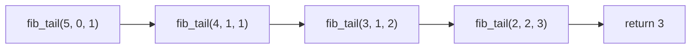

# Hello Algorithm notes

书本链接：[Hello 算法](https://github.com/krahets/hello-algo/releases/tag/1.2.0)


全书内容

- 复杂度分析
- 数据结构
- 算法

## 初识算法

- 算法是在有限时间内解决特定问题的一组指令或操作步骤
  - 问题包含清晰的输入和输出定义
  - 能够在有限步骤、时间和内存空间下完成
  - 在相同的输入和运行条件下，输出始终相同
- 数据结构是组织和存储数据的方式，涵盖数据内容、数据之间关系和数据操作方法。目标包括
  - 空间占用要少，以节省内存
  - 数据操作要快，包括数据访问、添加、删除、更新等
  - 数据表示简洁，逻辑信息简洁，好让算法高效
- 注意数据结构与算法高度相关，比如采取图的结构和链表的结构，都可以从输入得到所需输出，但是算法设计就不同，且在访问速度和内存占用上有别


## 复杂度分析

算法效率的衡量维度

- 时间效率：算法运行时间的长短
- 空间效率：算法占用内存空间的大小

评估方法<a id="复杂度分析-实测"> </a>

- 实际测试(局限性大)
  - 测试环境会有干扰，比如是否适合并行
  - 消耗资源，因为输入数据量大大小会影响算法效率的结论，故需要测试各种规模的输入数据
- 理论估算：(渐近)复杂度分析
  - 可以计算算法在理论上的时间复杂度和空间复杂度
  - 高效

分析算法复杂度涉及循环执行某段代码，下面介绍迭代和递归，两种重复的方法。

- 迭代：从第一步，第二步，一步一步往上走，直到\\(n\\)
- 递归，为了到达\\(n\\)，那么要先到达\\(n-1\\)，一直如此直到拆解到第一步

### 迭代

迭代(iteration)是一种重复执行某个任务的控制结构。程序会在满足一定的条件下循环执行某段代码，直到这个条件不再满足。

- for循环，在预先知道迭代次数上限时使用
- while循环，程序每轮都会先检查条件，如果条件为真，则继续执行，否则就结束循环。循环内部会更新条件变量
- 循环套循环

示例：\\(1+2+3+\cdots+n\\)，\\(\sum_{i=1}^n\sum_{j=1}^n f(i,j)\\)

```python
def for_loop(n: int) -> int:
    """for 循环"""
    res = 0 # result初始化结果变量
    for i in range(1, n + 1):
        res += i
    return res

def while_loop(n: int) -> int:
    """while 循环"""
    res = 0
    i = 1  # 初始化条件变量
    while i <= n:
        res += i
        i += 1  # 更新条件变量
    return res

def nested_for_loop(n: int) -> str:
    """双层 for 循环"""
    res = 0
    # 循环 i = 1, 2, ..., n-1, n
    for i in range(1, n + 1):
        # 循环 j = 1, 2, ..., n-1, n
        for j in range(1, n + 1):
            res += f({i}, {j})
    return res
```

### 递归

递归(recursion)是一种算法策略，通过函数调用自身来解决问题。

- 递：程序不断深入地调用自身，通常传入更小或更简化的参数，直到达到"终止条件"
- 归：触发"终止条件"后，程序从最深层的递归函数开始逐层返回，汇聚每一层的结果

普通递归示例：\\(1+2+3+\cdots+n\\)

```python
def recur(n: int) -> int:
    """递归"""
    # 终止条件
    if n == 1:
        return 1
    # 递：递归调用
    res = recur(n - 1)
    # 归：返回结果
    return n + res
```


递归的特点就是每次调用自身，但是会在内存中记录当前的调用，称为"栈帧空间"。比如`recur(5)`就会凭空产生`recur(5)`，`recur(4)`，`recur(3)`，`recur(2)`，`recur(1)`，所以更耗费内存。且由于涉及函数调用，所以比循环更废时间。为此定义**递归深度**：*在触发终止条件前，同时存在的未返回的递归函数个数*。过深的递归可能导致栈溢出错误。

这段代码的存栈过程和空间释放过程可以用下面这段代码理解。

```python
def for_loop_recur(n: int) -> int:
    """使用数组模拟递归"""
    # 使用一个显式的栈来模拟系统调用栈
    stack = []
    res = 0
    # 递：递归调用
    for i in range(n, 0, -1):
        # 通过"入栈操作"模拟"递"
        stack.append(i)
    # 此时stack = [n, n-1, ... 1]
    # 归：返回结果
    while stack:
        # 通过"出栈操作"模拟"归"
        res += stack.pop()
    # res = 1+2+3+...+n
    return res
```

#### 尾递归

如果函数在返回前的最后一步才进行递归调用，则该函数可以被编译器或解释器优化，使其在空间效率上与迭代相当。通过示例分析一下

```python
def tail_recur(n, res=0):
    """尾递归"""
    # 终止条件
    if n == 0:
        return res
    # 尾递归调用
    res += n
    return tail_recur(n - 1, res)
```

之前的代码的return可以简写为`return n+recur(n - 1)`，所以递归调用recur(n - 1)返回后，还要再做一次加法运算`+n`。尾递归的代码是先计算`+n`，再return。模拟如下

```python
def tail_recur_stack(n: int) -> int:
    """使用显式栈模拟尾递归"""
    stack = [(n, 0)]  # 保存 (n, res)，初始 res=0
    res = 0
    while stack:
        n, res = stack.pop()
        if n == 0:
            return res
        # 尾递归：只需更新参数后再压栈
        stack.append((n - 1, res + n))
```


尾递归中，函数返回到上一层级后，无须继续执行其他操作，因此系统无须保存上一层函数的上下文。但是Python不支持。

#### 递归树

示例：求斐波那契数列\\(f(n) = f(n-1)+f(n-2),f(1)=0,f(2)=1\\)。这种的也可以尾递归优化。

```python
def fib(n: int) -> int:
    """斐波那契数列：递归"""
    # 终止条件 f(1) = 0, f(2) = 1
    if n == 1 or n == 2:
        return n - 1
    # 递归调用 f(n) = f(n-1) + f(n-2)
    res = fib(n - 1) + fib(n - 2)
    # 返回结果 f(n)
    return res

def fib_tail(n: int, a: int = 0, b: int = 1) -> int:
    """
    尾递归版本斐波那契
    a = f(1), b = f(2)
    """
    if n == 1:
        return a
    if n == 2:
        return b
    return fib_tail(n - 1, b, a + b)
```

前者产生深度为n的递归树


后者的调用过程与普通尾递归类似，是一串



### 时间复杂度

直接运行计算时间，如[前所述](#复杂度分析-实测)不现实。时间复杂度分析统计的不是算法运行时间，而是算法运行时间随着数据量变大时的增长趋势。定义**函数渐近上界**：*给定一个输入大小为\\(n\\)的函数，算法的操作数量是一个关于输入数据大小\\(n\\)的函数，记为\\(T(n)\\)。若存在正实数\\(c\\)和实数\\(n_0\\)，使得对于所有的\\(n > n_0\\)，均有\\(T(n) \leq c \cdot f(n)\\)，则可认为\\(f(n)\\)给出了\\(T(n)\\)的一个渐近上界，记为\\(T(n) = O(f(n))\\)。*


1. 常数阶\\(O(1)\\)：\\(T(n)=1,T(n)=100000\\)，循环次数，运算次数都和输入数据大小无关
2. 对数阶\\(O(\log(n))\\)：\\(T(n)=\log_2(n)\\)，常见于运算次数在每个循环中减半的情况，比如一些递归函数
3. 线性阶\\(O(n)\\)：\\(T(n)=n,T(n)=3n+2\\)，常见于单层循环，总运算次数相对于输入数据大小以线性级别增长
4. 线性对数阶\\(O(n\log(n))\\)：\\(T(n)=1,T(n)=100000\\)，常见于嵌套循环。一个\\(O(n)\\)套一个\\(O(\log(n))\\)
5. 平方阶\\(O(n^2)\\)：\\(T(n)=1,T(n)=100000\\)，常见于嵌套循环。一个\\(O(n)\\)套一个\\(O(n)\\)
6. 指数阶\\(O(2^n)\\)：\\(T(n)=1,T(n)=100000\\)，常见于运算次数在每个循环加倍的情况，比如计算递归树
7. 阶乘阶\\(O(n!)\\)：\\(T(n)=1,T(n)=100000\\)，常见于运算次数在每个循环翻倍，倍数为上一个循环的运算次数减去一个常数


示例

```python
def constant(n: int) -> int:
    """常数阶"""
    count = 0
    size = 100000
    for _ in range(size):
        count += 1
    return count
def logarithmic(n: int) -> int:
    """对数阶(循环实现)"""
    count = 0
    while n > 1:
        n = n / 2
        count += 1
    return count
def log_recur(n: int) -> int:
    """对数阶(递归实现)"""
    if n <= 1:
        return 0
    return log_recur(n / 2) + 1
def linear(n: int) -> int:
    """线性阶"""
    count = 0
    for _ in range(n):
        count += 1
    return count
def array_traversal(nums: list[int]) -> int:
    """线性阶(遍历数组)"""
    count = 0
    # 循环次数与数组长度成正比
    for num in nums:
        count += 1
    return count
```

```python
def linear_log_recur(n: int) -> int:
    """线性对数阶"""
    if n <= 1:
        return 1
    # 一分为二，子问题的规模减小一半
    count = linear_log_recur(n // 2) + linear_log_recur(n // 2)
    # 当前子问题包含 n 个操作
    for _ in range(n):
        count += 1
    return count
def quadratic(n: int) -> int:
    """平方阶"""
    count = 0
    # 循环次数与数据大小 n 成平方关系
    for i in range(n):
        for j in range(n):
            count += 1
    return count
def bubble_sort(nums: list[int]) -> int:
    """平方阶(冒泡排序)"""
    count = 0  # 计数器
    # 外循环：未排序区间为 [0, i]
    for i in range(len(nums) - 1, 0, -1):
        # 内循环：将未排序区间 [0, i] 中的最大元素交换至该区间的最右端
        for j in range(i):
            if nums[j] > nums[j + 1]:
                # 交换 nums[j] 与 nums[j + 1]
                tmp: int = nums[j]
                nums[j] = nums[j + 1]
                nums[j + 1] = tmp
                count += 3  # 元素交换包含 3 个单元操作
    return count
```

```python
def exponential(n: int) -> int:
    """指数阶(循环实现)"""
    count = 0
    base = 1
    # 细胞每轮一分为二，形成数列 1, 2, 4, 8, ..., 2^(n-1)
    for _ in range(n):
        for _ in range(base):
            count += 1
        base *= 2
    # count = 1 + 2 + 4 + 8 + .. + 2^(n-1) = 2^n - 1
    return count
def exp_recur(n: int) -> int:
    """指数阶(递归实现)"""
    if n == 1:
        return 1
    return exp_recur(n - 1) + exp_recur(n - 1) + 1
def factorial_recur(n: int) -> int:
    """阶乘阶(递归实现)"""
    if n == 0:
        return 1
    count = 0
    # 从 1 个分裂出 n 个
    for _ in range(n):
        count += factorial_recur(n - 1)
    return count
```

算法的时间效率往往不是固定的，而是与输入数据的分布有关。为此定义算法的**最差时间复杂度**为\\(O(n)\\)，**最佳时间复杂度**为\\(\Omega(n)\\)。最简单的例子，在数组中寻找元素\\(1\\)出现的第一个索引。数组如果第一个元素就是\\(1\\)，就达到了最佳时间复杂度；若仅有一个元素\\(1\\)且排在最后，那就达到最差时间复杂度。在随机输入数据下的运行效率则定义为**平均时间复杂度**，使用记号\\(\Theta(n)\\)。

### 空间复杂度

空间复杂度(space complexity)用于衡量算法占用内存空间随着数据量变大时的增长趋势。

- 输入空间：用于存储算法的输入数据
- 暂存空间：用于存储算法在运行过程中的变量、对象、函数上下文等数据
  - 暂存数据：用于保存算法运行过程中的各种常量、变量、对象等
  - 栈帧空间：用于保存调用函数的上下文数据。系统在每次调用函数时都会在栈顶部创建一个栈帧，函数返回后，栈帧空间会被释放
  - 指令空间：用于保存编译后的程序指令，在实际统计中通常忽略不计
- 输出空间：用于存储算法的输出数据

计算时，一般统计暂存数据、栈帧空间和输出数据三部分。因为内存空间是一项硬性要求，通常只关注最差空间复杂度：

- 输入数据情况最差，比如说真要是循环起来，一定要到最后一个元素
- 以算法运行中的峰值内存为准

示例

```python
def function() -> int:
    # 执行某些操作
    return 0

def loop(n: int):
    """循环的空间复杂度为 O(1)"""
    for _ in range(n):
        function()

def recur(n: int):
    """递归的空间复杂度为 O(n)"""
    if n == 1:
        return
    return recur(n - 1)
```

|函数|时间复杂度|空间复杂度|
|loop|\\(O(n)\\)|\\(O(1)\\)，每次循环不占用栈帧空间|
|recur|\\(O(n)\\)|\\(O(n)\\)，每次循环栈帧空间+1|

常见类型如下

1. 常数阶\\(O(1)\\)：各个对象变量都和输入数据大小无关，对于支持尾递归优化的变成语言，其空间复杂度也是\\(O(1)\\)。不过绝大多数编程语言（例如 Java、Python、C++、Go、C# 等）不支持自动优化尾递归。
2. 对数阶\\(O(\log(n))\\)：常见于分治算法，例如归并排序，
3. 线性阶\\(O(n)\\)：常见于元素数量与\\(n\\)成正比的数组、链表、栈、队列等
4. 平方阶\\(O(n^2)\\)：常见于矩阵和图，元素数量与\\(n\\)成平方关系
5. 指数阶\\(O(2^n)\\)：常见于常见于二叉树

示例

```python
def linear(n: int):
    """线性阶"""
    # 长度为 n 的列表占用 O(n) 空间
    nums = [0] * n
    # 长度为 n 的哈希表占用 O(n) 空间
    hmap = dict[int, str]()
    for i in range(n):
        hmap[i] = str(i)
def linear_recur(n: int):
    """线性阶（递归实现）"""
    print("递归 n =", n)
    if n == 1:
        return
    linear_recur(n - 1)
def quadratic(n: int):
    """平方阶"""
    # 二维列表占用 O(n^2) 空间
    num_matrix = [[0] * n for _ in range(n)]
def quadratic_recur(n: int) -> int:
    """平方阶（递归实现）"""
    if n <= 0:
        return 0
    # 数组 nums 长度为 n, n-1, ..., 2, 1
    nums = [0] * n
    return quadratic_recur(n - 1)
```

```python
def build_tree(n: int) -> TreeNode | None:
    """指数阶（建立满二叉树）"""
    if n == 0:
        return None
    root = TreeNode(0)
    root.left = build_tree(n - 1)
    root.right = build_tree(n - 1)
    return root
def merge_sort(nums: list[int]) -> list[int]:
    """普通实现：归并排序（迭代版，自底向上）"""
    n = len(nums)
    size = 1
    while size < n:
        for left in range(0, n - size, size * 2):
            mid = left + size
            right = min(left + size * 2, n)
            nums[left:right] = merge(nums[left:mid], nums[mid:right])
        size *= 2
    return nums
def merge_sort_recur(nums: list[int]) -> list[int]:
    """递归实现：归并排序（自顶向下）"""
    if len(nums) <= 1:
        return nums
    mid = len(nums) // 2
    left = merge_sort_recur(nums[:mid])
    right = merge_sort_recur(nums[mid:])
    return merge(left, right)

def merge(left: list[int], right: list[int]) -> list[int]:
    res = []
    i = j = 0
    while i < len(left) and j < len(right):
        if left[i] <= right[j]:
            res.append(left[i]); i += 1
        else:
            res.append(right[j]); j += 1
    res.extend(left[i:])
    res.extend(right[j:])
    return res
```

归并排序的递归树图


优化时，降低时间复杂度通常需要以提升空间复杂度为代价，反之亦然，鱼与熊掌不可兼得。在大多数情况下，时间比空间更宝贵，因此"以空间换时间"通常是更常用的策略。若是在数据量很大的情况下，控制空间复杂度也非常重要。

## 数据结构

### 数据结构分类

### 基本数据类型

### 数字编码

### 字符编码